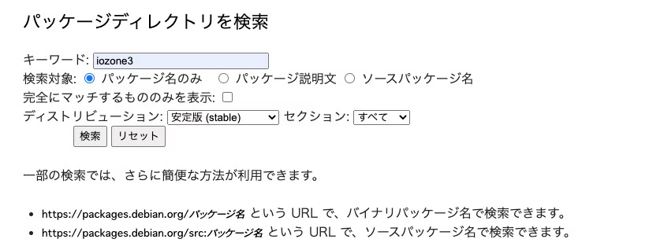
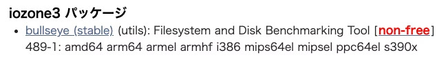

本稿では、aptコマンドを使ってDebianの標準以外のパッケージをインストールする方法を紹介します。

## 1. はじめに

Debianにパッケージをインストールする時には、aptコマンドを使うことが多いと思います。

デフォルトの状態ではDebianの公式リポジトリのみが`/etc/apt/sources.list`に設定されています。

そのため、サードパーティ製のパッケージ(Debianの公式リポジトリに登録されていないパッケージ)をインストールするためには、そのパッケージが格納されてるリポジトリを`/etc/apt/sources.list`に追加する必要があります。

今回は、以下の記事を参考に`iozone3`のインストールを例に手順を解説します。

- [apt-getで見つからないパッケージを追加する方法(debian, ubuntu両方対応)](https://qiita.com/kon_yu/items/8ac350f3951f8534c931)

## 2. 実行環境

- Debian GNU/Linux 11 (bullseye)

## 3. 手順

### 3-1.パッケージディレクトリを検索

以下のサイトから、インストールしたいパッケージが存在するリポジトリを検索します。

[Debian -- パッケージ](https://www.debian.org/distrib/packages#search_packages)

「キーワード」に`iozone3`と入力して「検索」。



`iozone3`は`non-free`リポジトリにあることがわかる。



### 3-2.リポジトリを追加

`/etc/apt/sources.list`に`non-free`リポジトリを追加します。

今回はリポジトリの追加に`apt-add-repository`コマンドを使用します(sources.listを自分で直接編集する方法もある)。

`apt-add-repository`コマンドを使用するには`software-properties-common`パッケージが必要です。

以下のコマンドを実行して、`software-properties-common`パッケージをインストールします。
```
$ apt install -y software-properties-common
```

※上記コマンドの-yオプションについて、以下apt-getのmanpageより抜粋

>-y, --yes, --assume-yes
>
>Automatic yes to prompts; assume "yes" as answer to all prompts and run non-interactively.
>
>If an undesirable situation, such as changing a held package, trying to install an unauthenticated package or removing an essential package occurs then apt-get will abort.
>
>Configuration Item: APT::Get::Assume-Yes.

次に、以下のコマンドを実行して`/etc/apt/sources.list`に`non-free`リポジトリを追加します。

```
$ apt-add-repository non-free
```

以下の`/etc/apt/sources.list`に`non-free`リポジトリが追加されたことがわかります。
```zsh
# deb http://ftp.jp.debian.org/debian bullseye main

deb http://ftp.jp.debian.org/debian bullseye main non-free
deb-src http://ftp.jp.debian.org/debian bullseye main non-free

deb http://security.debian.org/debian-security bullseye-security main non-free
deb-src http://security.debian.org/debian-security bullseye-security main non-free
```

### 3-3.パッケージをインストール

最後に`iozone3`をインストールします。

```
$ apt update
$ apt install -y iozone3
```

以上です。

---

【参考】

- [APT - Wikipedia](https://ja.wikipedia.org/wiki/APT)
- [APT HOWTO 基本的な設定](https://www.debian.org/doc/manuals/apt-howto/ch-basico.ja.html)
- [Ubuntu入門 – パッケージ管理コマンド apt とは？](https://weblabo.oscasierra.net/ubuntu-apt/)
- [Debian環境設定(4) /etc/apt/sources.list の設定](https://uhoho.hatenablog.jp/entry/2020/12/26/100627)
- [How do I enable non-free packages on Debian?](https://serverfault.com/questions/240920/how-do-i-enable-non-free-packages-on-debian)
- [What does -y mean in apt-get -y install command?](https://askubuntu.com/questions/672892/what-does-y-mean-in-apt-get-y-install-command)
- [The Debian Archive_2.2. Archive areas](https://www.debian.org/doc/debian-policy/ch-archive.html#archive-areas)
