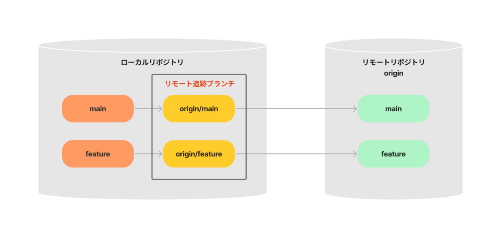
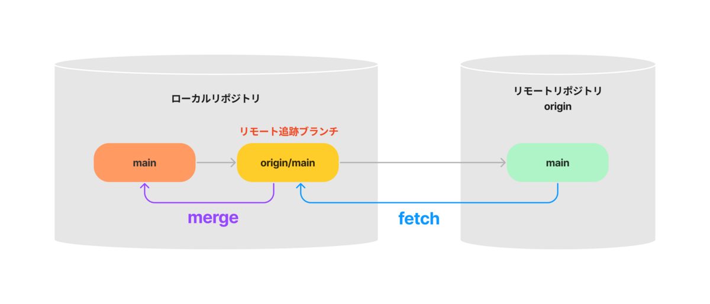

## 1. リモート追跡ブランチ、上流ブランチ



- リモート追跡ブランチ([remote-tracking branch](https://git-scm.com/docs/gitglossary#Documentation/gitglossary.txt-aiddefremotetrackingbrancharemote-trackingbranch))
    - リモートブランチの状態を追跡するブランチ
    - ローカルリポジトリに存在する(実体は`.git/refs/remotes/`)
- 上流ブランチ([upstream branch](https://git-scm.com/docs/gitglossary#Documentation/gitglossary.txt-aiddefupstreambranchaupstreambranch))
    - デフォルトでマージの対象となるブランチ(引数なしで`git merge`した時にマージされるブランチ)
    - mainブランチの上流ブランチがorigin/mainブランチである場合、「mainブランチはorigin/mainブランチを追跡している」と言う

## 2. fetch、merge、(pull)



- [fetch](https://git-scm.com/docs/git-fetch)：リモートリポジトリのmainブランチをローカルリポジトリのorigin/mainブランチに反映
- [merge](https://git-scm.com/docs/git-merge)：ローカルリポジトリのorigin/mainブランチをローカルリポジトリのmainブランチにマージ
- [pull](https://git-scm.com/docs/git-pull) = fetch + merge
    - `git pull origin main` = `git fetch origin` + `git merge origin/main`

## 3. 関連コマンド

### 3-1. 上流ブランチの設定

上流ブランチの設定([git-branch -u](https://git-scm.com/docs/git-branch#Documentation/git-branch.txt--ultupstreamgt))
```zsh
# git branch -u <リモート追跡ブランチ> <ローカルブランチ>
git branch -u origin/main main
```

push時に上流ブランチを設定([git-push -u](https://git-scm.com/docs/git-push#Documentation/git-push.txt--u))
```zsh
# mainブランチの上流ブランチにorigin/mainブランチが設定される
git push -u origin main
```

上流ブランチの設定を解除([git-branch --unset-upstream](https://git-scm.com/docs/git-branch#Documentation/git-branch.txt---unset-upstream))
```zsh
# git branch --unset-upstream <ローカルブランチ>
git branch --unset-upstream main
```

### 3-2. ブランチの確認
ローカルブランチとリモート追跡ブランチの表示([git-branch -a](https://git-scm.com/docs/git-branch#Documentation/git-branch.txt--a))
```zsh
git branch -a
```

リモート追跡ブランチの表示([git-branch -r](https://git-scm.com/docs/git-branch#Documentation/git-branch.txt--r))
```zsh
git branch -r
```

上流ブランチの確認([git-branch -vv](https://git-scm.com/docs/git-branch#Documentation/git-branch.txt--vv))([git-status](https://git-scm.com/docs/git-status))
```zsh
# 詳細
git branch -vv
```

```zsh
# シンプル
git status -bs
```

ローカルブランチとリモート追跡ブランチとの差分を表示([git-diff](https://git-scm.com/docs/git-diff))
```zsh
# git diff <ローカルブランチ> <リモート追跡ブランチ>
git diff main origin/main
```

### 3-3. リモート追跡ブランチの削除

指定して削除([git-branch -r](https://git-scm.com/docs/git-branch#Documentation/git-branch.txt--r))
```zsh
# git branch -d -r <リモート追跡ブランチ>
git branch -d -r origin/main
```

一斉に削除([git-fetch --prune](https://git-scm.com/docs/git-fetch#Documentation/git-fetch.txt---prune))([git-remote prune](https://git-scm.com/docs/git-remote#Documentation/git-remote.txt-empruneem))
```zsh
git fetch --prune
```
```zsh
# git remote prune <リポジトリ名>
git remote prune origin
```

___

【参考】

- [Git Branching - Remote Branches](https://git-scm.com/book/en/v2/Git-Branching-Remote-Branches#Tracking-Branches)
- [Git で「追跡ブランチ」って言うのやめましょう](https://qiita.com/uasi/items/69368c17c79e99aaddbf)
- [Delete remote-tracking branches in Git](https://www.techiedelight.com/delete-remote-branches-git/)
- [第17話 ローカルリポジトリに残ってしまうリモート追跡ブランチを一気に削除する prune オプション](https://www.r-staffing.co.jp/engineer/entry/20201023_1)
- [git fetchの理解からgit mergeとpullの役割](https://qiita.com/osamu1203/items/cb94ef9da02e1ec3e921)
- [【初心者向け】git fetch、git merge、git pullの違いについて](https://qiita.com/wann/items/688bc17460a457104d7d)
- [git: fetch and merge, don't pull | Mark's Blog](https://longair.net/blog/2009/04/16/git-fetch-and-merge/)
- [Git Fetch | Atlassian Git Tutorial](https://www.atlassian.com/git/tutorials/syncing/git-fetch)
- [git fetchとブランチ取り込み系コマンドの引数を省略すると？](https://qiita.com/matsumon-development/items/b37b1ce988fb810eb8ac)
