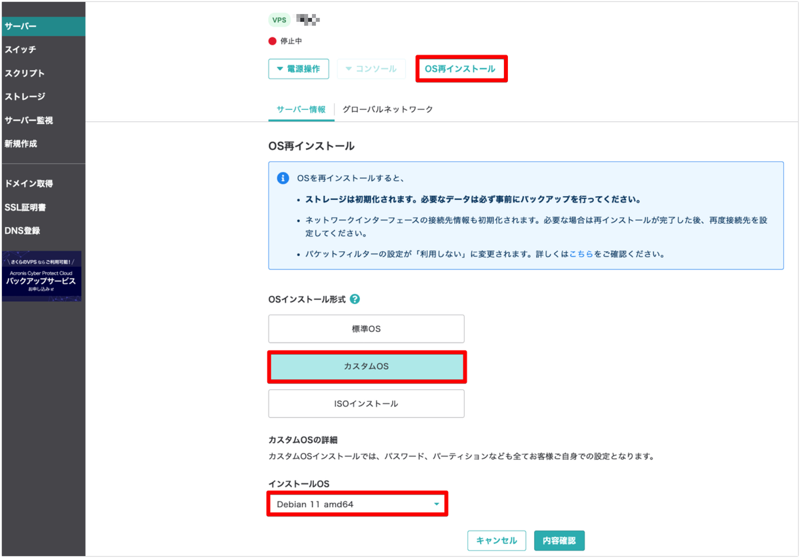

さくらのVPSにDebian11をインストールする手順を解説します。

サーバーを契約し、OSをインストールして、ユーザーを作成してログインします。

## 1. 手順

以下の手順で進めていきます。

1. さくらのVPSでサーバーを契約
1. Debian11のインストール
1. Debian11の設定
1. Debian11にログイン

### 1-1. さくらのVPSでサーバーを契約

以下にアクセスし、「お申し込み」を選択

[VPS（仮想専用サーバー）｜さくらインターネット](https://vps.sakura.ad.jp/)

- サーバー作成
  - サーバー選択
    - ゾーン：石狩第一
    - プラン：512MB(学習には最小プランで十分)
    - ストレージ変更オプション：SSD25GB
    - 購入台数：1台
    - 支払いパターン：毎月払い
  - サーバー設定
    - サーバー名：任意
    - サーバー説明：任意
    - OS設定
        - インストールするOS：どれでも(後で入れ直すため)
        - OSバージョン：どれでも(後で入れ直すため)
    - スタートアップスクリプト：利用しない
    - サーバーへのSSHキー登録：登録しない(後で入れ直すため)
  - 支払い方法
    - 初回は2ヶ月分の支払い

支払い完了後に以下の画面が表示され、数分後にサーバーが作成されます。

### 1-2. Debian11のインストール

さくらのVPSにログインして、コントロールパネルのサーバー一覧から作成したサーバーを選択

「OS再インストール」を選択し、OSインストール形式は「カスタムOS」、インストールOSは「Debian 11 amd64」を選択して「内容確認」をクリック

インストールOSが「Debian 11 amd64」になっていることを確認して、「OS再インストール」をクリック

### 1-3. Debian11の設定
作成したサーバーを選択し、「コンソール」>「VNCコンソール」を選択してVNCコンソールを起動

#### 1-3-1. rootユーザーの設定

rootユーザーのパスワードを設定して、「Continue」を選択

設定したパスワードを再度入力して、「Continue」を選択

#### 1-3-2. 一般ユーザーの設定

ユーザーのフルネームの設定は特に必要ないので何も入力せず、「Continue」を選択

一般ユーザーのユーザー名を設定して、「Continue」を選択

一般ユーザーのパスワードを設定して、「Continue」を選択

設定したパスワードを再度入力して、「Continue」を選択

#### 1-3-3. パーティションの設定

「Guided – use entire disk」を選択

「Virtual disk 1 (vda)」を選択

「Finish partitioning and write changes to disk」を選択

「Yes」を選択

パーティションのフォーマットが実行され、インストールの処理が進みます。

#### 1-3-4. OSインストールの完了

「Continue」を選択

VPSがシャットダウンされ、VNCコンソールの接続も切断されます。

### 1-4. Debian11にログイン

コントロールパネルに戻り、作成したサーバを選択後、以下の画面で「電源操作」>「起動する」をクリック

「実行」をクリックして、サーバーを起動します。

再度VNCコンソールを開き、以下の画面で先ほど設定したユーザー名とパスワードを入力してログインします。

無事ログインできれば設定は全て完了です！

---
【参考】

- https://manual.sakura.ad.jp/vps/os-reinstall/custom/de9-10.html#id2

- https://asmp78.hatenablog.com/entry/2020/01/16/072133
