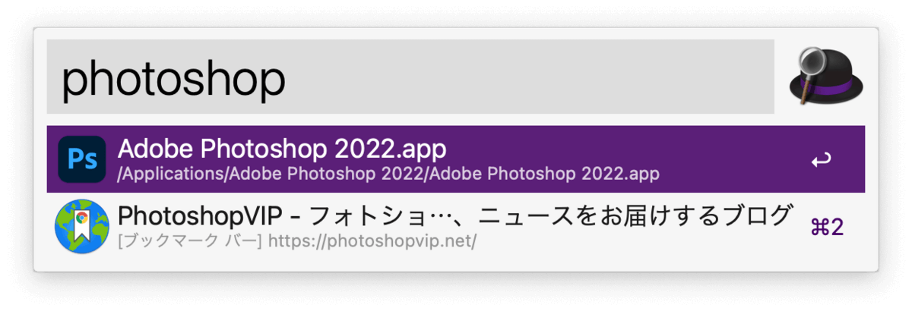

本稿では、macOS用ランチャーアプリAlfredの「ブックマーク検索機能」について、設定方法や使い方を解説していきます。

## 1. 環境
+ macOS Monterey バージョン12.2.1
+ Alfred 4.6.3

## 2. ブックマーク検索機能とは
Alfredの便利な機能の一つに「ブックマーク検索機能」があります。

ブックマークの名前・URL・フォルダ名で検索して、ブックマークしたサイトを開くことができます。

これまではブックマークしたサイトを開くには、以下の3ステップが必要でした。

1. ブラウザを開く
1. ブックマークを選択
1. サイトが表示される

これが、Alfredの「ブックマーク検索機能」を使うと以下のようになります。

1. Alfredで検索
1. サイトが表示される

たったの2ステップでブックマークしたサイトを開くことができます。

また、階層構造になったブックマークフォルダの場合も、見たいサイトを一発で開くことができます。

## 3. 設定方法

設定方法は「Alfredの設定」と「Macの設定」に分かれます。

### 3-1. Alfredの設定

まずはAlfredの「Web Bookmarks」の設定を行います。

#### 3-1-1. Alfred Preferencesを開く

Alfredを起動した状態で、デスクトップ上部のメニューバーからAlfredのアイコンを選択し、「Preferences...」をクリックしてAlfred Preferencesを開きます。

#### 3-1-2. Web Bookmarksを設定する

Alfred Preferencesの「Features」→「Web Bookmarks」から各項目の設定を行います。

##### Sources
ブックマークの検索対象とするブラウザを設定する項目です。

+ SafariとChromeで登録したブックマーク(またはどちらか一方のブックマークのみ)を検索対象に選択できます。
+ Chromeの場合は、選択したユーザーで登録したブックマークのみが検索対象になります。

##### Show bookmarks
ブックマーク検索時のプレフィックスを設定する項目です。

+ プレフィックスを指定して検索することで、検索結果にブックマークのみを表示することができます。

 **【実行例:ブックマークの「PhotoshopVIP」を検索】**

+ プレフィックスを設定していない場合(「in default results」)

**→PhotoshopVIPだけでなく、Photoshopアプリも検索結果に表示されてしまう。**

+ プレフィックスを設定した場合(「via keyward」で「bm」を設定)

**→PhotoshopVIPだけが表示される**

##### Open Bookmarks

ブックマークを表示するブラウザを設定する項目です。

+ 「in macOS default browser」
    + macで設定したデフォルトブラウザで検索したブックマークを開きます。
    + デフォルトブラウザは「システム環境設定」→「一般」→「デフォルトのWebブラウザ」から設定できます。
+ 「in bookmark's source browser」
    + ブックマークが登録されているブラウザで検索したブックマークを開きます。

### 3-2. Macの設定

先程のAlfredの設定だけではブックマーク検索機能は使えません。

ブックマーク検索機能を使えるようにするために、MacからAlfredのアプリにフルディスクアクセス権限を付与します。

#### 3-2-1. フルディスクアクセス設定画面を開く
Alfred Preferencesの「General」→「Permissions」→「Request Permissions...」をクリックします。

次に、「Full Disk Access」→「Open macOS Full Disk Access preferences」をクリックしてフルディスクアクセス設定画面を開きます。

※フルディスクアクセス設定画面は「システム環境設定」→「セキュリティとプライバシー」→「プライバシー」→「フルディスクアクセス」からも開くことができます。

#### 3-2-2. Alfredにフルディスクアクセス権限を付与する
以下のフルディスクアクセス設定画面で、鍵マークをクリックして権限の変更を可能にし、アプリケーションの一覧からAlfredにチェックをつけてフルディスクアクセス権限を付与します。

## 4. 使い方

試しにQiitaのトップページをブックマークに登録します。

Alfredを起動して「qiita」と入力すると、先程登録したQiitaのトップページのブックマークが表示されます。

あとはEnterキーを押すだけで、ブラウザが起動し、Qiitaのトップページが表示されます。

---

【参考】

+ [Browser Bookmarks - Alfred Help and Support](https://www.alfredapp.com/help/features/bookmarks/)
+ [Search your Browser Bookmarks in Alfred - Alfred Blog](https://www.alfredapp.com/blog/tips-and-tricks/search-browser-bookmarks-safari-chrome-in-alfred/)
+ [Tips and Tricks - Alfred Blog](https://www.alfredapp.com/blog/category/tips-and-tricks/)

