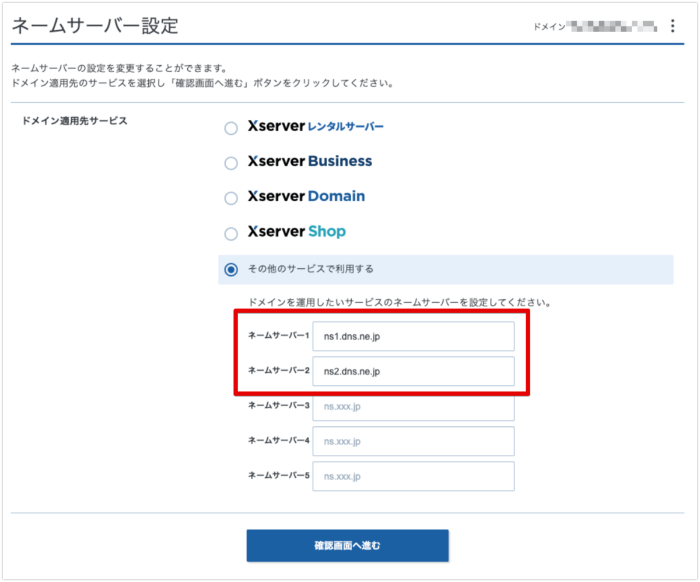
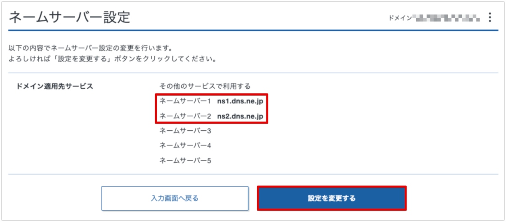
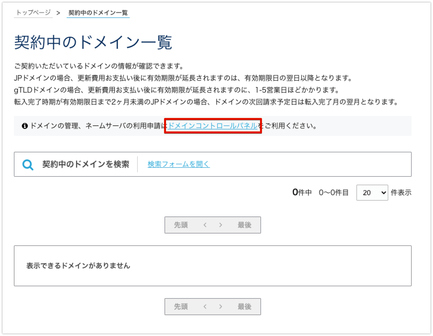
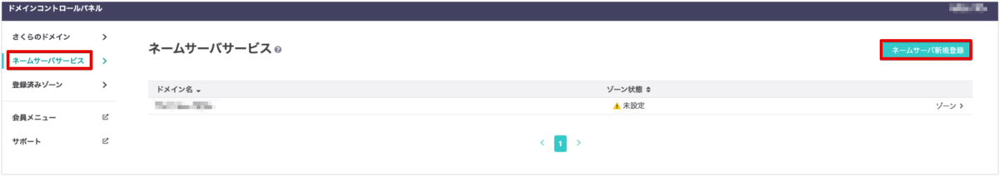
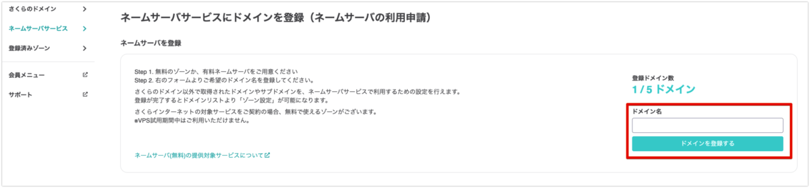
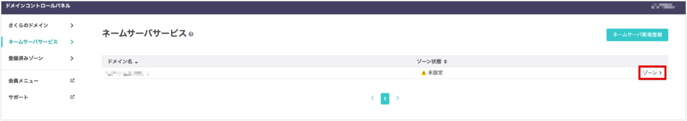
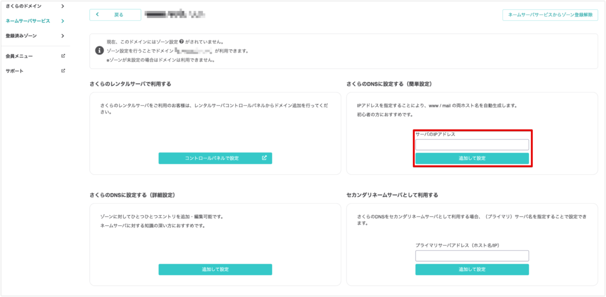

この記事ではさくらのネームサーバにXserverドメインで取得した独自ドメインを設定する方法を紹介します。

これによりさくらのVPSに作成したサーバに、設定したドメイン名でアクセスできるようになります。

- 前提条件
  - さくらのVPSでサーバを契約済み
  - Xserverドメインで取得した独自ドメインをXserverで使用

さくらのVPSでサーバを契約する方法は以下を参照してください。

[さくらのVPSにDebian11 (bullseye)をインストールする方法 | あまブログ](https://ama-blog.com/14/)

## 1. Xserverドメイン側の設定

### 1-1. ネームサーバー設定の変更

Xserverアカウントにログインします。

[XServerアカウント - ログイン | レンタルサーバーならエックスサーバー](https://secure.xserver.ne.jp/xapanel/login/xserver/)

ログイン後、該当のドメインを選択。

ドメイン選択後の画面で「ネームサーバー設定」>「設定変更」を選択。

ネームサーバー設定で「ドメイン適用先サービス」>「その他のサービスで利用する」を選択し、ネームサーバーに以下を入力します。

```
ns1.dns.ne.jp
ns2.dns.ne.jp
```

以下のようになっていればOKです。「確認画面へ進む」を選択します。




以下の画面で、設定内容を確認して「設定を変更する」を選択。



Xserverドメイン側の設定は以上です。

- [ネームサーバーの設定 | Xserverドメイン](https://www.xdomain.ne.jp/manual/man_domain_namesever_setting.php)

## 2. さくらのVPS側の設定

### 2-1. ドメイン名の登録

さくらインターネットの会員メニューにログインします。

[会員認証｜さくらインターネット](https://secure.sakura.ad.jp/auth/login?url=https://secure.sakura.ad.jp/menu/top/)

「契約中のドメイン一覧」を選択。

以下の画面で、「ドメインコントロールパネル」を選択。



以下の画面で、「ネームサーバサービス」>「ネームサーバ新規登録」を選択。



以下の画面で、利用したいドメイン名を入力し、「ドメインを登録する」を選択。



ネームサーバサービス一覧に追加したドメインが表示されたら、新規登録は完了です。

- [ネームサーバー（オプションサービス）を利用したい | さくらのサポート情報](https://help.sakura.ad.jp/domain/2303/)

### 2-2. ゾーン情報の作成

以下の画面で、先ほど追加したドメインの「ゾーン>」を選択します。(画面右側)



以下の画面で、「さくらのDNSに設定する(簡単設定)」でサーバーのIPアドレスを入力し、「追加して設定」を選択。



さくらのVPS側の設定は以上です。

- [ドメインのゾーン情報を編集したい | さくらのサポート情報](https://help.sakura.ad.jp/domain/2302/?article_anchor=js-nav-3)

以上で終了です。

---

【メモ】

- [【IIS】さくらのVPS(WindowsServer)にエックスサーバーの独自ドメインを設定してみた](https://pentan.net/sakuravps-xdomain-windows/)
- ネームサーバー
  - IPアドレスとドメイン名の紐付けを行うサーバー
  - = DNSサーバー
- ドメイン移管とは 
  - [ドメイン移管とは？移管の流れ・具体的な方法や費用・トラブルの原因まで解説！ – 初心者のためのブログ始め方講座](https://www.xserver.ne.jp/blog/domain-transfer/)
- 別のパターン
  - [他社で取得・管理中のドメインを設定したい | さくらのサポート情報](https://help.sakura.ad.jp/domain/2147/)
  - [さくらインターネットで取得・管理中のドメインを設定したい | さくらのサポート情報](https://help.sakura.ad.jp/domain/2145/)
  - [他社から移管したドメインを設定したい | さくらのサポート情報](https://help.sakura.ad.jp/domain/2146/)
