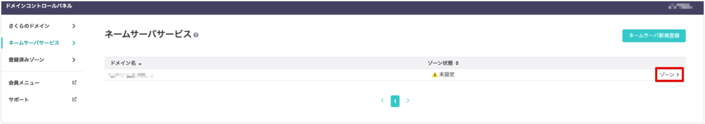
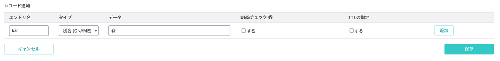

この記事ではさくらのVPSに設定した独自ドメインでサブドメインを利用できるようにする方法を紹介します。

これにより、契約ドメインは1つで複数のサイトを扱うことができます。

例えばfoo.comの独自ドメインにbarをサブドメインに設定することで、foo.comとbar.foo.comの2つのサイトを利用できます。

前提条件

- さくらのVPSを契約済み
- 独自ドメインを取得済み(お名前ドットコムやXserverドメインなどで作成)
- サブドメインを作成済み(お名前ドットコムやXserverドメインなどで作成)
- 独自ドメインをさくらのVPSに設定済み

[さくらのVPSにXserverドメインで取得した独自ドメインを設定する方法 | あまブログ](https://ama-blog.com/20/)

## 1. 設定方法

1.さくらインターネットの[ドメインコントロールパネル](https://secure.sakura.ad.jp/domain/domains)にアクセス。

2.「ネームサーバサービス」を選択

3.以下の画面で、設定済みのドメインの「ゾーン>」を選択します。(画面右側)

4.「編集」を選択

5.「レコード追加」で以下の情報を入力して「追加」を選択

- 「エントリ名」→サブドメイン名(barなど)
- 「タイプ」→別名(CNAME)
- 「データ」→@
- DNSチェック→チェックしない
- TTLの指定→チェックしない

6.「保存」を選択

以上で終了です。
