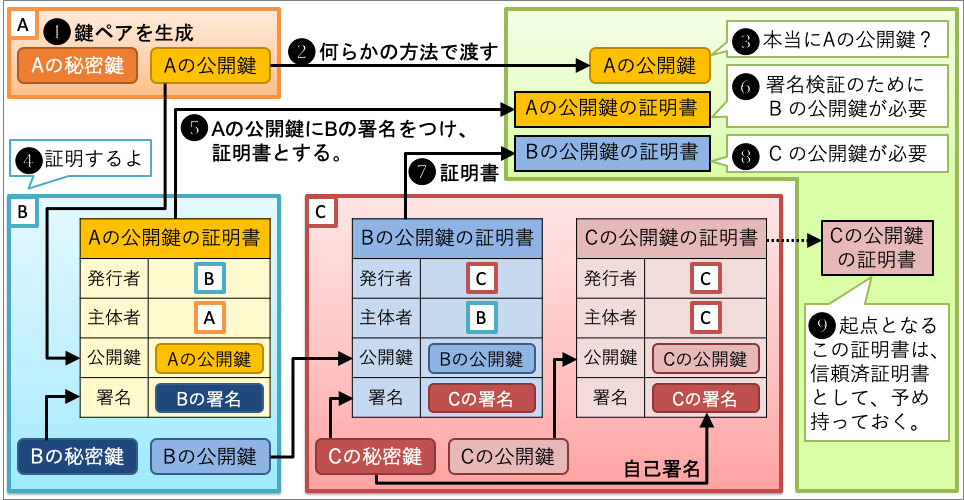

この記事では、Debian 11上のNginxでSSL対応サイトを作る方法を紹介します。

自己署名証明書を作成し、Nginxの設定を編集します。

Nginxの設定ファイルの詳しい解説は以下の記事を参照してください。

[【Debian】NginxでVirtual Hostsを使って複数のドメインを設定する方法【Server Blocks】 | あまブログ](https://ama-blog.com/19/)

## 1. 環境
- Debian GNU/Linux 11 bullseye (さくらのVPS)
- Nginx 1.21.6
- OpenSSL 1.1.1

## 2. SSLの概要

まず初めに、SSLの概要を説明します。

### 2-1. SSLの暗号化方式

- データのやりとりには共通鍵暗号を使う
- 共通鍵暗号で必要となる共通鍵の受け渡しに公開鍵暗号を使う

共通鍵暗号：暗号化と復号化に同じ鍵を使う

公開鍵暗号：秘密鍵で暗号化、ペアとなる公開鍵で復号化

### 2-2. 公開鍵証明書

- SSL証明書、サーバー証明書とも呼ばれる
- 認証局によるデジタル署名がついたサーバーの公開鍵のこと
  - 通信を行うサーバーが信頼できるかどうかを確認する仕組み
  - デジタル署名を自身で行なった証明書を自己署名証明書と言う(オレオレ証明書)

デジタル署名：秘密鍵で署名、ペアとなる公開鍵で検証

【公開鍵証明書発行の流れ】( [図解 X.509 証明書 #x.509 - Qiita](https://qiita.com/TakahikoKawasaki/items/4c35ac38c52978805c69) より)



<figure class="figure-image figure-image-fotolife" title="[図解 X.509 証明書](https://qiita.com/TakahikoKawasaki/items/4c35ac38c52978805c69#2-%E8%A8%BC%E6%98%8E%E6%9B%B8%E3%83%81%E3%82%A7%E3%83%BC%E3%83%B3)より">[f:id:djkazunoko:20220613115313p:plain]<figcaption>[図解 X.509 証明書](https://qiita.com/TakahikoKawasaki/items/4c35ac38c52978805c69#2-%E8%A8%BC%E6%98%8E%E6%9B%B8%E3%83%81%E3%82%A7%E3%83%BC%E3%83%B3)より</figcaption></figure>

## 3. 手順

以下の手順で進めていきます。

1. 公開鍵証明書の作成
1. Nginxの設定

また、本手順では、サーバーのホスト名を`test.com`とします。

### 3-1. 公開鍵証明書の作成

サーバーの秘密鍵と公開鍵証明書を作成します。

まずは、opensslをインストール。
```
$ sudo apt install openssl
```

秘密鍵と公開鍵証明書を生成。(ここで生成される公開鍵証明書は自己署名証明書)
```
$ sudo openssl req -x509 -nodes -days 365 -newkey rsa:2048 -subj /CN=test.com -keyout /etc/ssl/private/nginx.key -out /etc/ssl/certs/nginx.crt
```

- `req`：CSR(Certificate Signing Request：証明書署名要求)を生成するためのサブコマンド。
- `-x509`：CSRではなく自己署名証明書を生成する。
- `-nodes`：公開鍵証明書のパスフレーズ設定をスキップ。パスフレーズを設定するとNginxを再起動するたびに入力する必要がある。
- `-days`：生成する公開鍵証明書の有効期限を指定。
- `-newkey rsa:2048`：公開鍵証明書と秘密鍵を同時に生成する。rsa:2048で2048ビットのrsa鍵を指定。
- `-subj /CN=test.com`：Common Nameにホスト名を指定。-subjオプションを指定しない場合、プロンプトが表示され入力を求められる。CN以外はテキトーな値でいい。
- `-keyout`：生成する秘密鍵のファイル名を指定。
- `-out`：生成する公開鍵証明書のファイル名を指定。

#### 3-1-1. 細かくやると

先程行った秘密鍵と公開鍵証明書の生成を、「秘密鍵の生成」と「公開鍵証明書の生成」に分けて行うと以下のようになります。

**秘密鍵の生成**
```
$ sudo openssl genrsa -out /etc/ssl/private/nginx.key
```

- `genrsa`：RSA秘密鍵を生成するサブコマンド(デフォルトで2048ビットのRSA秘密鍵を生成)
- `-out`：生成する秘密鍵のファイル名

**公開鍵証明書の生成**
```
$ sudo openssl req -x509 -key /etc/ssl/private/nginx.key -subj /CN=test.com -out /etc/ssl/certs/nginx.crt
```
- `-key`：署名に使う秘密鍵を指定

---

- 内容確認のコマンド
  - 公開鍵証明書の内容確認：`openssl x509 -text -noout -in <公開鍵証明書のファイル名>`
  - 秘密鍵の内容確認：`openssl rsa -text -noout -in <秘密鍵のファイル名>`
  - CSRの内容確認：`openssl req -text -noout -in <CSRのファイル名>`
- OpenSSLコマンドリファレンス
  - [openssl-req](https://www.openssl.org/docs/man1.1.1/man1/openssl-req.html)
  - [openssl-x509](https://www.openssl.org/docs/man1.1.1/man1/openssl-x509.html)
  - [openssl-rsa](https://www.openssl.org/docs/man1.1.1/man1/openssl-rsa.html)
  - [openssl-genrsa](https://www.openssl.org/docs/man1.1.1/man1/openssl-genrsa.html)

### 3-2. Nginxの設定

`/etc/nginx/sites-available/test.com`を編集していきます。

設定ファイルを編集する前にバックアップを取ります。

```
$ sudo cp /etc/nginx/sites-available/test.com /etc/nginx/sites-available/test.com.bk
```

設定ファイルを編集します。

```
$ sudo vi /etc/nginx/sites-available/test.com
```

`/etc/nginx/sites-available/test.com`
```diff
server {
        listen 80;
+       listen 443 ssl;

+       ssl_certificate /etc/ssl/certs/nginx.crt;
+       ssl_certificate_key /etc/ssl/private/nginx.key;

        root /var/www/test.com/html;
        index index.html;

        server_name test.com www.test.com;

        access_log /var/log/nginx/test.com.access.log;
        error_log /var/log/nginx/test.com.error.log;
}
```

上記の設定では、HTTP(80番ポート)とHTTPS(443番ポート)の設定を共有しています。

つまり `http://~` と `https://~` でアクセスすることができ、HTTPの暗号化されていない通信とHTTPSの暗号化された通信の両方を許可します。

通常であれば `http://~` のアクセスを`https://~`にリダイレクトして、ユーザには`https://~`でのアクセスのみを許可します。

以下ではその設定を行います。

#### 3-2-1. HTTPをHTTPSにリダイレクトする場合
```diff
server {
-       listen 80;
        listen 443 ssl;

        ssl_certificate /etc/ssl/certs/nginx.crt;
        ssl_certificate_key /etc/ssl/private/nginx.key;

        root /var/www/test.com/html;
        index index.html;

        server_name test.com www.test.com;

        access_log /var/log/nginx/test.com.access.log;
        error_log /var/log/nginx/test.com.error.log;
}

+ server {
+    listen 80;
+
+    server_name test.com www.test.com;
+
+    return 301 https://$server_name$request_uri;
+ }
```

Nginxを再起動して設定の変更を反映させます。
```
$ sudo systemctl restart nginx
```

以上で設定は終了です。

ブラウザから `http://~` と `https://~` でアクセスし、どちらも `https://~`のページが表示されればOKです。

---


- [Alphabetical index of directives](https://nginx.org/en/docs/dirindex.html)
  - [ssl_certificate](https://nginx.org/en/docs/http/ngx_http_ssl_module.html#ssl_certificate)
  - [ssl_certificate_key](https://nginx.org/en/docs/http/ngx_http_ssl_module.html#ssl_certificate_key)
- [Alphabetical index of variables](https://nginx.org/en/docs/varindex.html)
  - [$server_name](https://nginx.org/en/docs/http/ngx_http_core_module.html#var_server_name)
  - [$request_uri](https://nginx.org/en/docs/http/ngx_http_core_module.html#var_request_uri)

---

【参考】

- [図解 X.509 証明書 #x.509 - Qiita](https://qiita.com/TakahikoKawasaki/items/4c35ac38c52978805c69)
- [図解で学ぶネットワークの基礎：SSL編 | 日経クロステック（xTECH）](https://xtech.nikkei.com/it/article/COLUMN/20071002/283518/)
- [[Think IT] 第6回：SSLの基本を押さえる (1/3)](https://thinkit.co.jp/free/article/0706/3/6/)
- [オレオレ証明書をopensslで作る（詳細版） - ろば電子が詰まつてゐる](https://ozuma.hatenablog.jp/entry/20130511/1368284304)
- [How To Create a Self-Signed SSL Certificate for Nginx in Ubuntu 16.04 | DigitalOcean](https://www.digitalocean.com/community/tutorials/how-to-create-a-self-signed-ssl-certificate-for-nginx-in-ubuntu-16-04)
- [How to Create and Use Self-Signed SSL in Nginx](https://www.howtogeek.com/devops/how-to-create-and-use-self-signed-ssl-on-nginx/)
- [Configuring HTTPS servers](https://nginx.org/en/docs/http/configuring_https_servers.html)
- [nginx連載6回目: nginxの設定、その4 - TLS/SSLの設定 - インフラエンジニアway - Powered by HEARTBEATS](https://heartbeats.jp/hbblog/2012/06/nginx06.html)
- [Creating NGINX Rewrite Rules – NGINX Community Blog](https://blog.nginx.org/blog/creating-nginx-rewrite-rules#https)
- https://www.nginx.com/resources/wiki/start/topics/tutorials/config_pitfalls/#server-name-if
