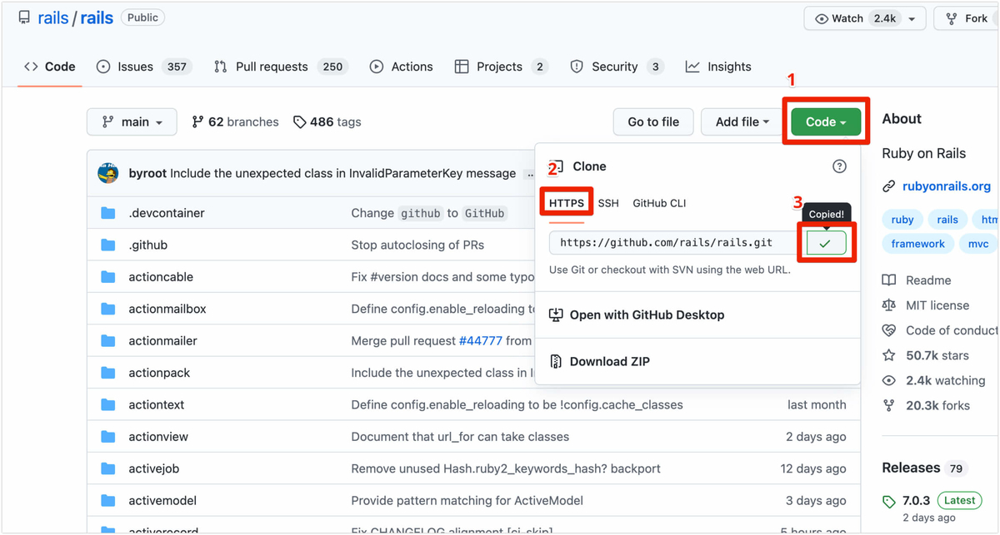

この記事ではGutHubでPull Requestを使った開発の流れを紹介します。

## 1. 準備

まずは開発用のリポジトリを作成します。

リポジトリの作成方法には以下の2つがあります。

1. リポジトリを自分で作る
1. 既存のリポジトリをcloneする

### 1-1. リポジトリを自分で作る

リポジトリの作成方法は、以下の手順を参照してください。

[【Git】リポジトリの作成 | あまブログ](https://ama-blog.com/32/)

### 1-2. 既存のリポジトリをcloneする

チーム開発等で既にリポジトリが存在する場合は、以下の手順でリモートリポジトリをcloneします。

```
$ mkdir <ディレクトリ名>
$ cd <ディレクトリのパス>
$ git clone <リポジトリのURL>
```

※リポジトリのURLの取得方法



## 2. 開発の流れ

以下の流れで行います。

1. リモートのmainをローカルのmainに反映させる
1. 作業ブランチを作成する
1. ファイルの編集・追加を行う(コードを書く)
1. ファイルの編集・追加をローカルに反映させる
1. 作業ブランチをリモートにpushする
1. Pull Requestを作成する
1. フィードバックを受ける
1. Pull Requestをマージする

### 2-1. リモートのmainをローカルのmainに反映させる

まずはリモートのmainブランチの状態をローカルのmainブランチに反映させる。(最新のmainの状態にする)

```
$ git checkout main
$ git pull origin main
```

### 2-2. 作業ブランチを作成する

```
$ git checkout -b <ブランチ名> main
```

- 上記はmainブランチを派生元に指定。

### 2-3. ファイルの編集・追加を行う(コードを書く)

作成したブランチ上でコードを書く。

### 2-4. ファイルの編集・追加をローカルに反映させる

作業した内容をローカルの作業ブランチに反映させる。

```
$ git status
$ git add <編集・追加したファイル名>
$ git commit -m "<コミットメッセージ>"
```

### 2-5. 作業ブランチをリモートにpushする

```
$ git push origin <ブランチ名>
```

この時点でリモートに作業ブランチが作成される。

### 2-6. Pull Requestを作成する

GitHub上からPull Requestを作成する。

- `base`には取り込み先のブランチ(main)を、`compare`には取り込んでほしいブランチ(作業ブランチ)を指定。
- ブランチ間の差分を確認すること。

### 2-7. フィードバックを受ける

他の開発者にレビューをしてもらい、フィードバックを受ける。

修正があれば手順3~5を再度行う。(修正→commit→push)

- プルリク作成後はforce pushを使わない
  - force pushを使うとプルリクのConversationの流れを壊してしまうため

### 2-8. Pull Requestをマージする

Pull Requestの内容に問題がなければ、Pull Requestをマージする。

この時点で、リモートの作業ブランチを削除する。

---

【参考】

- [GitHub のフロー](https://docs.github.com/ja/get-started/quickstart/github-flow)
