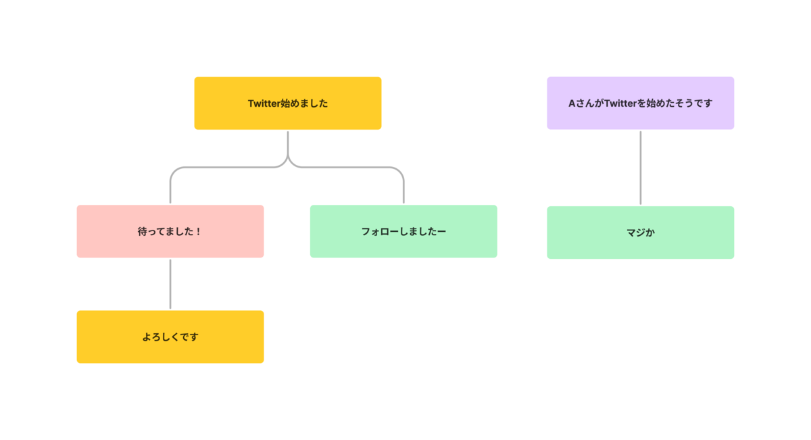
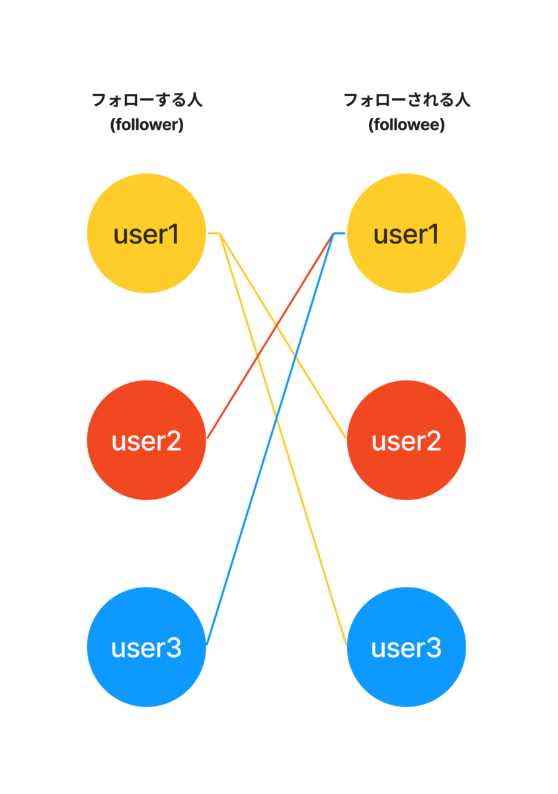

この記事ではTwitterのサイトのER図の書き方を解説します。

論理設計の対象はTwitterの一部の機能に限定し、ER図はIE記法で、Draw.ioで作成しました。

## 1. 対象の機能
- ユーザを表示する
- ツイートする
- ツイートに返信する
- リツイートする
- 引用ツイートする
- フォローする
- フォロー一覧を表示する
- フォロワー一覧を表示する
- リストにユーザーを追加する
- リスト一覧を表示する
- リストをフォローする

## 2. ER図

## 3. テーブル定義

### 3-1. usersテーブル

ユーザーの情報を管理するテーブル

- username
  - `@`から始まるアカウント固有の識別名(ユーザー名)
- name
  - 表示名(名前)
- bio
  - 自己紹介
- location
  - 場所
- website
  - ウェブサイト
- date_of_birth
  - 生年月日
- profile_image
  - プロフィール画像
- header_image
  - ヘッダー画像

### 3-2. tweetsテーブル

ユーザーのツイートを管理するテーブル

- user_id
  - ツイートしたユーザーのid
- content
  - ツイート文
- image
  - ツイート画像
- reply_to
  - 返信の場合、返信先のツイートのidが入る
  - 通常のツイートの場合はnull(または0)が入る
- quote_tweet_id
  - 引用ツイートの場合、引用元のツイートのidが入る
  - 通常ツイートの場合、null(または0)が入る

### 3-3. retweetsテーブル

リツイートしたユーザーとリツイートされたツイートの関連を表すテーブル(誰がどのツイートをリツイートしたかの情報を持つテーブル)

- user_id
  - リツイートしたユーザーのid
- tweet_id
  - リツイートされたツイートのid

### 3-4. followsテーブル

フォローしたユーザーとフォローされたユーザーの関連を表すテーブル(誰をフォローして誰にフォローされているかの情報を持つテーブル)

- follower_id
  - フォローという行為をしたユーザーのid(誰かをフォローしたユーザーのid = 誰かのフォロワーになるユーザーのid)
- followee_id
  - フォローの対象となるユーザーのid(誰かにフォローされているユーザーのid)

### 3-5. listsテーブル

リストの情報を管理するテーブル

- user_id
  - リストを作成したユーザーのid(リストの所有者)
- name
  - リストの名前
- description
  - リストの詳細
- header_image
  - ヘッダー画像
- is_private
  - リストの公開・非公開の状態を表す

### 3-6. list_membersテーブル

リストとそのリストに所属するユーザーの関連を表すテーブル(誰がどのリストに所属するかの情報を持つテーブル)

- user_id
  - リストに所属するユーザーのid
- list_id
  - ユーザーが所属するリストのid

### 3-7. follow_listsテーブル

リストとそのリストをフォローしているユーザーの関連を表すテーブル(誰がどのリストをフォローしているかの情報を持つテーブル)

- user_id
  - リストをフォローしているユーザーのid
- list_id
  - ユーザーがフォローしているリストのid

## 4. 解説

### 4-1. tweetsテーブルについて

- ツイートへの返信機能に関して、ツイートの階層構造を隣接リストモデルで表現(tweetsテーブルを自己参照する形)
  - 自己参照に関して、ER図の多重度は、親のツイートが0か1か、子のツイートが0か複数か
- 引用ツイートは通常のツイートと同様に本文や画像を追加できるため、tweetsテーブルで管理

【レコードの例】

| id | user_id | content | image | reply_to | quote_tweet_id |
|-----------|------------|------------|------------|------------|------------|
| 1 | 1 | Twitter始めました | null | null | null |
| 2 | 2 | 待ってました！ | null | 1 | null |
| 3 | 1 | よろしくです | null | 2 | null |
| 4 | 3 | AさんがTwitterを始めたそうです | null | null | 1 |
| 5 | 4 | マジか | null | 4 | null |
| 6 | 4 | フォローしましたー | null | 1 | null |

### 4-2. フォローについて

- usersテーブルとfollowsテーブルの関連について、2本の矢印はfollowerとfolloweeのものと考えれば良い(フォロー機能だけを見れば、followerとfolloweeを抽象化してまとめたものがusersテーブルと考えられる)

【レコードの例】

| id | follower_id | followee_id |
|-----------|------------|------------|
| 1 | 1 | 2 |
| 1 | 1 | 3 |
| 1 | 2 | 1 |
| 1 | 3 | 1 |

---

【参考】

- [「followee」の意味や使い方 わかりやすく解説 Weblio辞書](https://www.weblio.jp/content/followee)
- [自己参照関係ってどんな関係？ - Xupper技術サポート部のページ](https://blog.goo.ne.jp/tecsup/e/fc2958a69546895a76bc8bdf8b5fcf6b)
- [２つの階層構造「自己参照型」と「部品表型」 - 設計者の発言](https://dbconcept.hatenablog.com/entry/2021/07/24/123217)
- [富士通エンジニアリングテクノロジーズ株式会社](https://global.fujitsu/ja-jp/subsidiaries/fetec)
- [【初心者向け】丁寧すぎるRails『アソシエーション』チュートリアル【幾ら何でも】【完璧にわかる】 #Ruby - Qiita](https://qiita.com/kazukimatsumoto/items/14bdff681ec5ddac26d1)
- [リツイートする方法 | Twitterヘルプ](https://help.twitter.com/ja/using-twitter/how-to-retweet)
- [Twitterの返信と@ツイートする方法 | Twitterヘルプ](https://help.twitter.com/ja/using-twitter/mentions-and-replies)
- [リストについて | Twitterヘルプ](https://help.twitter.com/ja/using-twitter/twitter-lists)
