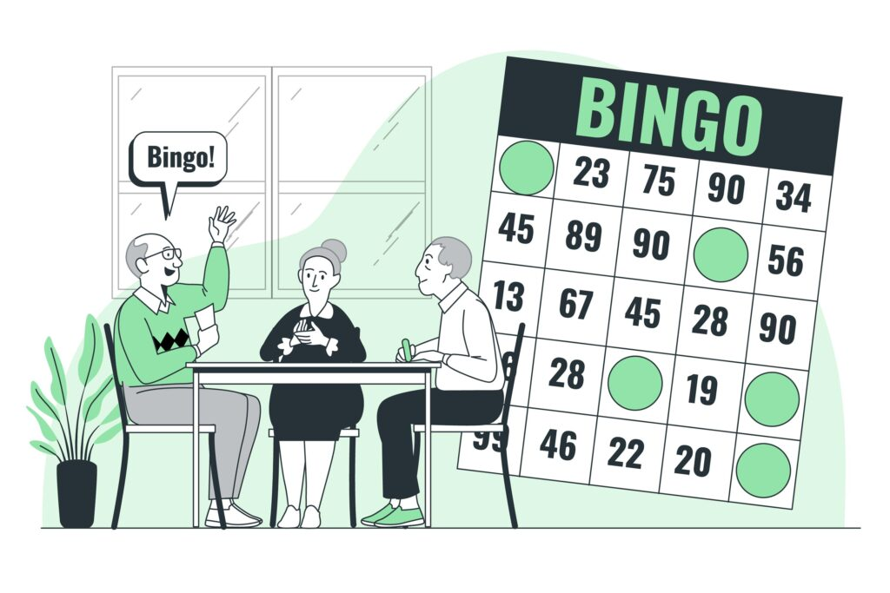
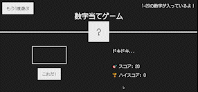

**JavaScript初心者でも簡単に作れるゲームが知りたい！**

**ゲームの作り方の詳しい解説やソースコードも見たい！**

- 本記事の内容
  - ゲームの完成形とソースコード
  - ゲームの作り方の解説

この記事は、**JavaScriptの基礎文法を一通り学んで「実際に何かを作ってみたい！」** という方に向けたものになっています。

ライブラリなどは一切使わず、JavaScriptの基礎文法だけで作れるゲームを紹介します。

今回作るゲームはJavaScript初心者の方でも30分で作ることができます。

実際に手を動かして、JavaScriptの理解を深めていきましょう！

## 1. 数字当てゲーム



簡単な「数字当てゲーム」を作っていきます。

### 1-1. 完成形とソースコード

以下が今回作るゲームの完成形です。



- 1~20までの数字を予想してスコアを競うゲームです。
- 表示されるヒントを頼りに正解の数字を予想していきます。
- より少ない回数で数字を当てると高得点になります。

[デモサイト](https://djkazunoko.github.io/guess_number/)で実際の動きを確認できます。

ソースコードは[こちら](https://github.com/djkazunoko/guess_number/tree/main/docs)から確認できます。

### 1-2. このゲームを作って学べること

今回の「数字当てゲーム」を作って学べることは以下の2つです。

- JavaScriptのDOM操作
- コードのリファクタリング

### 1-3. 用意するもの

以下の3つのファイルを用意しましょう。

- `index.html`
- `style.css`
- `script.js`

これらのファイルは[こちら](https://github.com/djkazunoko/guess_number/tree/main/starter)にあります。

## 2. まずはゲームの仕様を理解しよう


コードを書く前に、まずはゲームの仕様を理解しましょう。

### 2-1. 仕様の確認

今回の「数字当てゲーム」は大きく3つの機能に分けることができます。

- メイン機能
  - ユーザーが数字を入力してチェックボタンをクリックすると処理を実行
  - 入力された値によって異なるメッセージを表示
  - 入力された数字が不正解の場合、スコアを1減らしてゲーム続行
  - 入力された数字が正解の場合、正解の数字を表示してゲーム終了
- リセット機能
  - リセットボタンをクリックしてゲームを再スタート
- ハイスコア機能
  - ハイスコアを表示する

### 2-2. 必要な要素の確認

必要な要素は以下の7つです。

1. 正解の数字(secretNumber)
2. 入力された数字(inputNumber)
3. スコア(score)
4. メッセージ(message)
5. チェックボタン(check)
6. リセットボタン(reset)
7. ハイスコア(highscore)

**1. 正解の数字(secretNumber)**

変数secretNumberに1~20までのランダムな数字を設定します。

正解した時にこの数字を表示させます。

**2. 入力された数字(inputNumber)**

変数inputNumberにユーザーにより入力された数字を代入します。

この値をもとに条件分岐を行います。

**3. スコア(score)**

変数scoreの初期値に20を設定します。

不正解のたびに-1することでゲームのスコアを記録します。

**4. メッセージ(message)**

ユーザーにより入力された値によって適切なメッセージを表示します。

DOM操作により動的にメッセージを変更します。

**5. チェックボタン(check)**

チェックボタンがクリックされると、入力された数字によって条件分岐を行い、それぞれの処理を行います。

**6. リセットボタン(reset)**

リセットボタンがクリックされると、ゲーム開始時の状態にリセットされます。

**7. ハイスコア(highscore)**

変数highscoreにゲームのハイスコアが保存されます。

## 3. ゲームの作り方【解説】


ここからは実際にコードを書いていきましょう！

### 3-1. メイン機能の実装（チェックボタンのイベント処理）

まずはメイン機能のうち、チェックボタンのイベント処理を実装します。

**変数に初期値を設定**
```javascript
'use strict';
 
let secretNumber = Math.trunc(Math.random() * 20) + 1; /* 1~20までのランダムな整数を生成 */
let score = 20;
let highscore = 0;
```

変数secretNumberに1~20までのランダムな数字を設定します。

Math.random()で0~0.999、*20することで0~19.999、Math.trunc()で少数部分を取り除くので0~19に、最後に+1をして1~20までの整数が生成されます。

変数scoreに初期値の20を、変数highscoreに初期値の0を設定します。

**addEventListener()メソッドによるイベント処理**
```javascript
document.querySelector('.check').addEventListener('click', function () {
  const inputNumber = Number(document.querySelector('.inputNumber').value);
 
});
```

次にチェックボタンがクリックされた時の処理を記述します。

checkクラスのbuttonタグがクリックされると処理が行われます。

最初の処理として、inputNumberクラスのinputタグに入力された値を、定数inputNumberに代入します。

この時、入力された値はstring型なのでNumber()メソッドを使い、number型に変換します。

**ここまでのコード**
```javascript
'use strict';
 
let secretNumber = Math.trunc(Math.random() * 20) + 1; /* 1~20までのランダムな整数を生成 */
let score = 20;
let highscore = 0;
 
document.querySelector('.check').addEventListener('click', function () {
  const inputNumber = Number(document.querySelector('.inputNumber').value);
 
});
```

### 3-2. メイン機能の実装(条件分岐)

次にメイン機能の条件分岐を実装します。
ユーザーにより入力された値によって以下の4パターンの条件分岐を行います。

**パターン1：入力されていない時の処理**

```javascript
document.querySelector('.check').addEventListener('click', function () {
  const inputNumber = Number(document.querySelector('.inputNumber').value);
 
  // 入力されていない時
  if (!inputNumber) {
    document.querySelector('.message').textContent = '数字を入力してね！';
    
  // 正解の時
  } else if (inputNumber === secretNumber) {
 
  // 入力された数字が正解より大きい時
  } else if (inputNumber > secretNumber) {
 
  // 入力された数字が正解より小さい時
  } else if (inputNumber < secretNumber) {
 
  }
});
```

入力されていない時の処理はメッセージの表示のみです。

「!inputNumber」は入力されていない時、または0が入力された時を意味します。

**パターン2：正解の時の処理**

```javascript
document.querySelector('.check').addEventListener('click', function () {
  const inputNumber = Number(document.querySelector('.inputNumber').value);
 
  // 入力されていない時
  if (!inputNumber) {
    document.querySelector('.message').textContent = '数字を入力してね！';
 
  // 正解の時
  } else if (inputNumber === secretNumber) {
    document.querySelector('.message').textContent = '正解！🎉';
    document.querySelector('.secretNumber').textContent = secretNumber;
    document.querySelector('body').style.backgroundColor = '#60b347';
 
  // 入力された数字が正解より大きい時
  } else if (inputNumber > secretNumber) {
 
  // 入力された数字が正解より小さい時
  } else if (inputNumber < secretNumber) {
 
  }
});
```

正解の時の処理は「メッセージの表示」「正解の数字の表示」「背景色の変更」を行います。

styleのbackgroundColorはキャメルケースで書きます。

**パターン3：入力された数字が正解より大きい時の処理**

```javascript
document.querySelector('.check').addEventListener('click', function () {
  const inputNumber = Number(document.querySelector('.inputNumber').value);
 
  // 入力されていない時
  if (!inputNumber) {
    document.querySelector('.message').textContent = '数字を入力してね！';
 
  // 正解の時
  } else if (inputNumber === secretNumber) {
    document.querySelector('.message').textContent = '正解！🎉';
    document.querySelector('.secretNumber').textContent = secretNumber;
    document.querySelector('body').style.backgroundColor = '#60b347';
 
  // 入力された数字が正解より大きい時
  } else if (inputNumber > secretNumber) {
    if (score > 1) {
      document.querySelector('.message').textContent = 'もっと小さいよ📉😏';
      score--;
      document.querySelector('.score').textContent = score; 
    } else {
      document.querySelector('.message').textContent = 'ゲームオーバー🤪';
      document.querySelector('.score').textContent = 0;
      document.querySelector('body').style.backgroundColor = '#DC3544';
    }
 
  // 入力された数字が正解より小さい時
  } else if (inputNumber < secretNumber) {
 
  }
});
```

入力された数字が正解より大きい時(不正解の時)はさらにscoreの値によって条件分岐をネストさせます。

scoreが0点になるとゲームオーバーになるように実装しています。

score > 1の時はゲーム続行なので、「メッセージの表示」「scoreを1点減らす」「変更後のscoreの表示」を行います。

それ以外の場合はゲームオーバーなので、「メッセージの表示」「scoreに0を表示」「背景色の変更」を行います。

ゲームオーバーの時にscoreを1点減らすのではなくscoreに0を表示している理由は、scoreがマイナスの値になるのを防ぐためです。

**パターン4：入力された数字が正解より小さい時の処理**

```javascript
document.querySelector('.check').addEventListener('click', function () {
  const inputNumber = Number(document.querySelector('.inputNumber').value);
 
  // 入力されていない時
  if (!inputNumber) {
    document.querySelector('.message').textContent = '数字を入力してね！';
 
  // 正解の時
  } else if (inputNumber === secretNumber) {
    document.querySelector('.message').textContent = '正解！🎉';
    document.querySelector('.secretNumber').textContent = secretNumber;
    document.querySelector('body').style.backgroundColor = '#60b347';
 
  // 入力された数字が正解より大きい時
  } else if (inputNumber > secretNumber) {
    if (score > 1) {
      document.querySelector('.message').textContent = 'もっと小さいよ📉😏';
      score--;
      document.querySelector('.score').textContent = score; 
    } else {
      document.querySelector('.message').textContent = 'ゲームオーバー🤪';
      document.querySelector('.score').textContent = 0;
      document.querySelector('body').style.backgroundColor = '#DC3544';
    }
 
  // 入力された数字が正解より小さい時
  } else if (inputNumber < secretNumber) {
    if (score > 1) {
      document.querySelector('.message').textContent = 'もっと大きいよ📈😏';
      score--;
      document.querySelector('.score').textContent = score; 
    } else {
      document.querySelector('.message').textContent = 'ゲームオーバー🤪';
      document.querySelector('.score').textContent = 0;
      document.querySelector('body').style.backgroundColor = '#DC3544';
    }
 
  }
});
```

入力された数字が正解より小さい時の処理は大きい時の処理とほとんど同じです。

唯一の違いは表示するメッセージ内容だけです。

**ここまでのコード**

```javascript
'use strict';
 
let secretNumber = Math.trunc(Math.random() * 20) + 1; /* 1~20までのランダムな整数を生成 */
let score = 20;
let highscore = 0;
 
document.querySelector('.check').addEventListener('click', function () {
  const inputNumber = Number(document.querySelector('.inputNumber').value);
 
  // 入力されていない時
  if (!inputNumber) {
    document.querySelector('.message').textContent = '数字を入力してね！';
 
  // 正解の時
  } else if (inputNumber === secretNumber) {
    document.querySelector('.message').textContent = '正解！🎉';
    document.querySelector('.secretNumber').textContent = secretNumber;
    document.querySelector('body').style.backgroundColor = '#60b347';
 
  // 入力された数字が正解より大きい時
  } else if (inputNumber > secretNumber) {
    if (score > 1) {
      document.querySelector('.message').textContent = 'もっと小さいよ📉😏';
      score--;
      document.querySelector('.score').textContent = score; 
    } else {
      document.querySelector('.message').textContent = 'ゲームオーバー🤪';
      document.querySelector('.score').textContent = 0;
      document.querySelector('body').style.backgroundColor = '#DC3544';
    }
 
  // 入力された数字が正解より小さい時
  } else if (inputNumber < secretNumber) {
    if (score > 1) {
      document.querySelector('.message').textContent = 'もっと大きいよ📈😏';
      score--;
      document.querySelector('.score').textContent = score; 
    } else {
      document.querySelector('.message').textContent = 'ゲームオーバー🤪';
      document.querySelector('.score').textContent = 0;
      document.querySelector('body').style.backgroundColor = '#DC3544';
    }
 
  }
});
```

### 3-3. リセット機能の実装

次にリセット機能を実装していきます。

**リセット機能**

```javascript
document.querySelector('.reset').addEventListener('click', function() {
  // スコアのリセット
  score = 20;
  document.querySelector('.score').textContent = score;
 
  // シークレットナンバーのリセット
  secretNumber = Math.trunc(Math.random() * 20) + 1;
  document.querySelector('.secretNumber').textContent = '?';
 
  // メッセージのリセット
  document.querySelector('.message').textContent = 'ドキドキ...';
 
  // 入力欄のリセット
  document.querySelector('.inputNumber').value = '';
  
  // 背景色のリセット
  document.querySelector('body').style.backgroundColor = '#222';
});
```

ユーザーがリセットボタンをクリックしたら、ゲーム開始時の状態に戻るようにします。

resetクラスのbuttonタグがクリックされると処理を行い、上記5つの項目を開始時の状態に戻します。

それぞれquerySelector()メソッドで指定したセレクターに値を代入します。

secretNumberには再び1~20までのランダムな数字が設定されます。

**ここまでのコード**

```javascript
'use strict';
 
let secretNumber = Math.trunc(Math.random() * 20) + 1; /* 1~20までのランダムな整数を生成 */
let score = 20;
let highscore = 0;
 
document.querySelector('.check').addEventListener('click', function () {
  const inputNumber = Number(document.querySelector('.inputNumber').value);
 
  // 入力されていない時
  if (!inputNumber) {
    document.querySelector('.message').textContent = '数字を入力してね！';
 
  // 正解の時
  } else if (inputNumber === secretNumber) {
    document.querySelector('.message').textContent = '正解！🎉';
    document.querySelector('.secretNumber').textContent = secretNumber;
    document.querySelector('body').style.backgroundColor = '#60b347';
 
  // 入力された数字が正解より大きい時
  } else if (inputNumber > secretNumber) {
    if (score > 1) {
      document.querySelector('.message').textContent = 'もっと小さいよ📉😏';
      score--;
      document.querySelector('.score').textContent = score; 
    } else {
      document.querySelector('.message').textContent = 'ゲームオーバー🤪';
      document.querySelector('.score').textContent = 0;
      document.querySelector('body').style.backgroundColor = '#DC3544';
    }
 
  // 入力された数字が正解より小さい時
  } else if (inputNumber < secretNumber) {
    if (score > 1) {
      document.querySelector('.message').textContent = 'もっと大きいよ📈😏';
      score--;
      document.querySelector('.score').textContent = score; 
    } else {
      document.querySelector('.message').textContent = 'ゲームオーバー🤪';
      document.querySelector('.score').textContent = 0;
      document.querySelector('body').style.backgroundColor = '#DC3544';
    }
 
  }
});
 
document.querySelector('.reset').addEventListener('click', function() {
  // スコアのリセット
  score = 20;
  document.querySelector('.score').textContent = score;
 
  // シークレットナンバーのリセット
  secretNumber = Math.trunc(Math.random() * 20) + 1;
  document.querySelector('.secretNumber').textContent = '?';
 
  // メッセージのリセット
  document.querySelector('.message').textContent = 'ドキドキ...';
 
  // 入力欄のリセット
  document.querySelector('.inputNumber').value = '';
 
  // 背景色のリセット
  document.querySelector('body').style.backgroundColor = '#222';
});
```

### 3-4. ハイスコア機能の実装

最後にハイスコア機能を実装します。

**ハイスコア機能**

```javascript
document.querySelector('.check').addEventListener('click', function () {
  const inputNumber = Number(document.querySelector('.inputNumber').value);
 
  // 入力されていない時
  if (!inputNumber) {
    document.querySelector('.message').textContent = '数字を入力してね！';
 
  // 正解の時
  } else if (inputNumber === secretNumber) {
    document.querySelector('.message').textContent = '正解！🎉';
    document.querySelector('.secretNumber').textContent = secretNumber;
    document.querySelector('body').style.backgroundColor = '#60b347';
    // ハイスコア機能
    if (score > highscore) {
      highscore = score;
      document.querySelector('.highscore').textContent = highscore;
    }
    
  // 入力された数字が正解より大きい時
  } else if (inputNumber > secretNumber) {
    if (score > 1) {
      document.querySelector('.message').textContent = 'もっと小さいよ📉😏';
      score--;
      document.querySelector('.score').textContent = score; 
    } else {
      document.querySelector('.message').textContent = 'ゲームオーバー🤪';
      document.querySelector('.score').textContent = 0;
      document.querySelector('body').style.backgroundColor = '#DC3544';
    }
 
  // 入力された数字が正解より小さい時
  } else if (inputNumber < secretNumber) {
    if (score > 1) {
      document.querySelector('.message').textContent = 'もっと大きいよ📈😏';
      score--;
      document.querySelector('.score').textContent = score; 
    } else {
      document.querySelector('.message').textContent = 'ゲームオーバー🤪';
      document.querySelector('.score').textContent = 0;
      document.querySelector('body').style.backgroundColor = '#DC3544';
    }
  }
});
```

ハイスコアの更新は正解した時に行います。

仕組みはとてもシンプルで、正解した時のscoreがhighscoreより大きい時にhighscoreをそのscoreで更新するだけです。

highscoreの初期値は0のため初回の正解時は必ずhighscoreが更新されます。

**ここまでのコード**

```javascript
'use strict';
 
let secretNumber = Math.trunc(Math.random() * 20) + 1; /* 1~20までのランダムな整数を生成 */
let score = 20;
let highscore = 0;
 
document.querySelector('.check').addEventListener('click', function () {
  const inputNumber = Number(document.querySelector('.inputNumber').value);
 
  // 入力されていない時
  if (!inputNumber) {
    document.querySelector('.message').textContent = '数字を入力してね！';
 
  // 正解の時
  } else if (inputNumber === secretNumber) {
    document.querySelector('.message').textContent = '正解！🎉';
    document.querySelector('.secretNumber').textContent = secretNumber;
    document.querySelector('body').style.backgroundColor = '#60b347';
    
    if (score > highscore) {
      highscore = score;
      document.querySelector('.highscore').textContent = highscore;
    }
    
  // 入力された数字が正解より大きい時
  } else if (inputNumber > secretNumber) {
    if (score > 1) {
      document.querySelector('.message').textContent = 'もっと小さいよ📉😏';
      score--;
      document.querySelector('.score').textContent = score; 
    } else {
      document.querySelector('.message').textContent = 'ゲームオーバー🤪';
      document.querySelector('.score').textContent = 0;
      document.querySelector('body').style.backgroundColor = '#DC3544';
    }
 
  // 入力された数字が正解より小さい時
  } else if (inputNumber < secretNumber) {
    if (score > 1) {
      document.querySelector('.message').textContent = 'もっと大きいよ📈😏';
      score--;
      document.querySelector('.score').textContent = score; 
    } else {
      document.querySelector('.message').textContent = 'ゲームオーバー🤪';
      document.querySelector('.score').textContent = 0;
      document.querySelector('body').style.backgroundColor = '#DC3544';
    }
  }
});
 
document.querySelector('.reset').addEventListener('click', function() {
  // スコアのリセット
  score = 20;
  document.querySelector('.score').textContent = score;
 
  // シークレットナンバーのリセット
  secretNumber = Math.trunc(Math.random() * 20) + 1;
  document.querySelector('.secretNumber').textContent = '?';
 
  // メッセージのリセット
  document.querySelector('.message').textContent = 'ドキドキ...';
 
  // 入力欄のリセット
  document.querySelector('.inputNumber').value = '';
 
  // 背景色のリセット
  document.querySelector('body').style.backgroundColor = '#222';
});
```

### 3-5. コードのリファクタリング

ここまでで、ひとまずゲームは完成です。

ここではコードのリファクタリングを行います。

コードの無駄を省き、見やすいコードを目指しましょう。

**リファクタリング①条件分岐**

ここまでユーザーがチェックボタンをクリックした時の条件分岐は以下の4パターンでした。

1. 入力されていない時
1. 正解の時
1. 入力された数字が正解より大きい時
1. 入力された数字が正解より小さい時

以下のコードを見ると「入力された数字が正解より大きい時」と「入力された数字が正解より小さい時」の2つの処理がほとんど同じ内容であることがわかります。

**条件分岐(リファクタリング前)**

```javascript
document.querySelector('.check').addEventListener('click', function () {
  const inputNumber = Number(document.querySelector('.inputNumber').value);
 
  // 入力されていない時
  if (!inputNumber) {
    document.querySelector('.message').textContent = '数字を入力してね！';
 
  // 正解の時
  } else if (inputNumber === secretNumber) {
    document.querySelector('.message').textContent = '正解！🎉';
    document.querySelector('.secretNumber').textContent = secretNumber;
    document.querySelector('body').style.backgroundColor = '#60b347';
    
    if (score > highscore) {
      highscore = score;
      document.querySelector('.highscore').textContent = highscore;
    }
    
  // 入力された数字が正解より大きい時
  } else if (inputNumber > secretNumber) {
    if (score > 1) {
      document.querySelector('.message').textContent = 'もっと小さいよ📉😏';
      score--;
      document.querySelector('.score').textContent = score; 
    } else {
      document.querySelector('.message').textContent = 'ゲームオーバー🤪';
      document.querySelector('.score').textContent = 0;
      document.querySelector('body').style.backgroundColor = '#DC3544';
    }
 
  // 入力された数字が正解より小さい時
  } else if (inputNumber < secretNumber) {
    if (score > 1) {
      document.querySelector('.message').textContent = 'もっと大きいよ📈😏';
      score--;
      document.querySelector('.score').textContent = score; 
    } else {
      document.querySelector('.message').textContent = 'ゲームオーバー🤪';
      document.querySelector('.score').textContent = 0;
      document.querySelector('body').style.backgroundColor = '#DC3544';
    }
  }
});
```

これら2つの処理を「不正解の時」という条件で1つにまとめたコードが以下です。

**条件分岐(リファクタリング後)**

```javascript
document.querySelector('.check').addEventListener('click', function () {
  const inputNumber = Number(document.querySelector('.inputNumber').value);
 
  // 入力されていない時
  if (!inputNumber) {
    document.querySelector('.message').textContent = '数字を入力してね！';
 
  // 正解の時
  } else if (inputNumber === secretNumber) {
    document.querySelector('.message').textContent = '正解！🎉';
    document.querySelector('.secretNumber').textContent = secretNumber;
    document.querySelector('body').style.backgroundColor = '#60b347';
 
    if (score > highscore) {
      highscore = score;
      document.querySelector('.highscore').textContent = highscore;
    }
    
  // 不正解の時
  } else if (inputNumber !== secretNumber) {
    if (score > 1) {
      document.querySelector('.message').textContent = inputNumber > secretNumber ? 'もっと小さいよ📉😏' : 'もっと大きいよ📈😏';
      score--;
      document.querySelector('.score').textContent = score; 
    } else {
      document.querySelector('.message').textContent = 'ゲームオーバー🤪';
      document.querySelector('.score').textContent = 0;
      document.querySelector('body').style.backgroundColor = '#DC3544';
    }
  }
});
```

かなりシンプルになったことがわかります。

入力された数字が正解の数字より大きいか小さいかでメッセージを出し分ける処理には、条件演算子(三項演算子)を使っています。

**リファクタリング②メッセージの表示**

最後にメッセージの表示の処理を関数にまとめます。

ここまで以下のような形式でメッセージを表示する場面が何度かありました。

**メッセージの表示(リファクタリング前)**

```javascript
document.querySelector('.message').textContent = 'メッセージの内容';
```

今回のように簡単な処理の場合は関数にしなくても大丈夫ですが、これが何行にもわたる複雑な処理の場合、何度も書くのは大変ですし、変更があった場合は修正が大変です。

何度も登場する処理は以下のように関数にしましょう。

**メッセージの表示(リファクタリング後)**

```javascript
const displayMessage = (message) => {
  document.querySelector('.message').textContent = message;
};
```

全てのリファクタリングを反映させた完成形のコードが以下です。

**完成形のコード**

```javascript
'use strict';
 
let secretNumber = Math.trunc(Math.random() * 20) + 1;
let score = 20;
let highscore = 0;
 
const displayMessage = (message) => {
  document.querySelector('.message').textContent = message;
};
 
document.querySelector('.check').addEventListener('click', function () {
  const inputNumber = Number(document.querySelector('.inputNumber').value);
 
  // 入力されていない時
  if (!inputNumber) {
    displayMessage('数字を入力してね！');
 
  // 正解の時
  } else if (inputNumber === secretNumber) {
    displayMessage('正解！🎉');
    document.querySelector('.secretNumber').textContent = secretNumber;
    document.querySelector('body').style.backgroundColor = '#60b347';
 
    if (score > highscore) {
      highscore = score;
      document.querySelector('.highscore').textContent = highscore;
    }
 
  // 不正解の時
  } else if (inputNumber !== secretNumber) {
    if (score > 1) {
      displayMessage(inputNumber > secretNumber ? 'もっと小さいよ📉😏' : 'もっと大きいよ📈😏');
      score--;
      document.querySelector('.score').textContent = score; 
    } else {
      displayMessage('ゲームオーバー🤪');
      document.querySelector('.score').textContent = 0;
      document.querySelector('body').style.backgroundColor = '#DC3544';
    }
  }
});
 
document.querySelector('.reset').addEventListener('click', function() {
  // スコアのリセット
  score = 20;
  document.querySelector('.score').textContent = score;
 
  // シークレットナンバーのリセット
  secretNumber = Math.trunc(Math.random() * 20) + 1;
  document.querySelector('.secretNumber').textContent = '?';
 
  // メッセージのリセット
  displayMessage('ドキドキ...');
 
  // 入力欄のリセット
  document.querySelector('.inputNumber').value = '';
  
  // 背景色のリセット
  document.querySelector('body').style.backgroundColor = '#222';
});
```

## 4. まとめ


この記事ではJavaScriptの基礎知識だけで簡単なゲームを作る方法を解説してきました。

僕自身ゲーム作りは難しいんだろうなと思っていたんですけど、やってみたら意外に簡単で面白かったです。

何かを作ることが一番の勉強になると思うので、この記事を参考に皆さんもいろんなゲームやアプリを作ってみてください！

今回は以上です。
