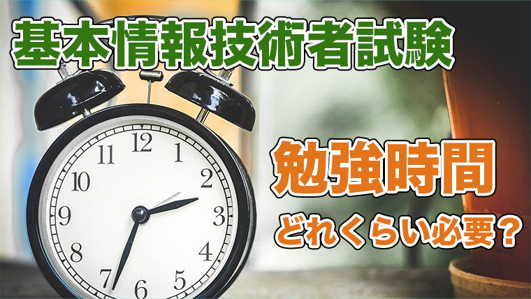
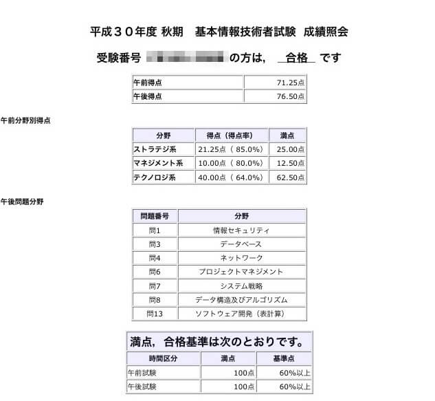
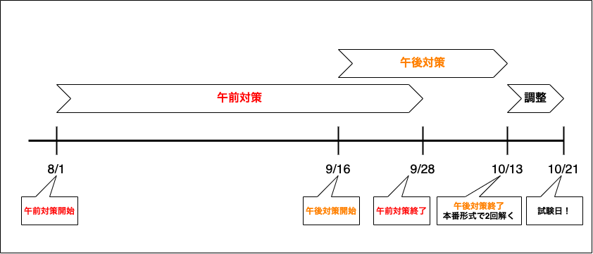

- 本記事の内容
  - IT業界未経験から合格までに必要な勉強時間
  - 勉強のスケジュール
  - 勉強内容
  - オススメの参考書

<u>**今回はIT業界未経験から独学で基本情報技術者試験に合格するための方法を解説します。**</u>

この記事を書いている僕は、平成30年度秋期 基本情報技術者試験に合格しました。

これから基本情報技術者試験の勉強を始める方は、ぜひこの記事を読んでみてください！

## 1. IT業界未経験でも3ヶ月の勉強期間で合格できる

IT業界未経験の方でも、<u>**3ヶ月で180時間**</u>の勉強で合格できます。

### 1-1. 当時の自分のレベル

社会人1年目の10月に受験しました。

学生時代にパソコンに触れる機会は、Wordでレポートを提出するときくらいでした。

試験勉強を始める前にやっていたことといえば、社内研修で1ヶ月間C言語を教わったことくらいです。

基本情報技術者試験に合格すれば会社から資格取得手当が貰えたし、何かしらの勉強はしたかったので、存在を知った瞬間から受験する気はありました。

ただ流石にまだ合格は無理だろうと思って、1年目の10月は受験しないで次の2年目の4月に受験しようと思っていました。

7月くらいに現場の先輩から「基本情報受けるの？」と聞かれ、まだ無理だと思うから今回は受けないと答えると、「いやいや今からでも全然行けるっしょ」と受験する気がないことに結構驚かれました。

そしたらなんか僕も「え、マジっすか、いけんすか。」ってなって、「いけんのかぁ、じゃ受けてみようかなぁ」って感じで受けたら、いけました。

このような感じで僕のような素人でも3ヶ月の勉強で合格できたので、受験しようか迷ってる方にはぜひ挑戦してほしいです！

### 1-2. 合格までに必要な勉強時間

**IT業界未経験で知識0からのスタートでも、180時間あれば十分に合格レベルまで持っていけます。**

期間は余裕を持って3ヶ月くらいあるといいです。

毎日2時間×90日=180時間が理想ですが、仕事がある人は平日1時間、土日に5時間ずつで週15時間×12週間=180時間くらいのペースでもいいです。

180時間の配分はざっくり以下を目指しましょう。

- 午前対策
  - 80時間
- 午後対策
  - 100時間

## 2. 勉強のスケジュール

ここからは勉強のスケジュールを紹介していきます。

僕の場合は以下のようなスケジュールで勉強しました。

入社した4月に会社から基本情報技術者試験の参考書が支給されていたので、図に示す期間の前から参考書を読んだりしていました。

8/1に午前試験の過去問を1回解いてみたところから本格的な勉強スタートです。

そこから9/16までは午前対策のみを行いました。

9/16から午後対策を始めたので、9/16~9/28までの期間は午前、午後どちらの勉強もしている状態です。

9/28で完全に午前対策をやめて、午後対策のみに集中しました。

本番1週間前の10/13~10/14の二日間で、本番同様に午前・午後を通しで2回分解きました。

ラスト1週間は最後の調整で、午後試験を中心に今までやったことを確認したり、気になるところの過去問を解き直したりしていました。

## 3. 勉強内容

ここからは実際に行った勉強内容を紹介していきます。

### 3-1. 午前試験

以下の流れで午前試験の勉強を行いました。

* 試しに過去問を1回分解いてみる
* 参考書1周
* 過去問演習と参考書の復習
  * 過去問1~50→3回分
  * 過去問51~80→19回分
  * 参考書2~3周目
* 過去問1~80→3回分

まずは点数を気にせずにとりあえず過去問を1回解いてみて午前試験がどのようなものかを確認しました。

そのあとで参考書を簡単に1周読み、あとはひたすら過去問演習をしました。

参考書の2~3周目もがっつり読みこむのではなく、過去問演習をしていく中でわからない用語に遭遇したら、その都度参考書で確認していくという方法で読み進めていきました。

過去問51〜80をかなり解いていますが、これは51〜80(マネジメント/ストラテジ系)は計算用紙がいらず、1問にかかる時間が短いので仕事中暇なときに[基本情報技術者試験ドットコム](https://www.fe-siken.com/)でずっと解いていたためです。

僕の場合、午前対策の期間が8/1〜9/28の59日間とずいぶん長いですが、最初はのんびり勉強していたということもあるので、この内容なら40日間×2時間=80時間くらいで終わると思います。

知識0からのスタートだと知らない単語だらけなので午前対策の期間が長くなりがちですが、午前試験は暗記ゲーなので、そこまで一生懸命理解しようとしなくても大丈夫です。

**とりあえず過去問を解きまくって、ある程度いけそうだと思ったら午前対策はやめて、午後対策に移りましょう。**

### 3-2. 午後試験

以下の流れで午後試験の勉強を行いました。

* 試しに過去問を1回分解いてみる(問1~8,13)
* 各設問対策
  * 問1(情報セキュリティ)→11回分
  * 問2(ハードウェア&ソフトウェア)→4回分
  * 問3(データベース)→5回分
  * 問4(ネットワーク)→4回分
  * 問5(ソフトウェア設計)→5回分
  * 問6(プロマネorサビマネ)→5回分
  * 問7(システム戦略or経営戦略/企業と法務)→6回分
  * 問8(アルゴリズム)→9回分
  * 問13(表計算)→5回分
* 本番演習→2回分

午後対策はあまり期間がなかったので全力でやりました。

**「過去問を解く→解説を読んで理解する」、ひたすらこれの繰り返しです。**

午後対策も午前対策同様、まずは点数を気にせず過去問を1回解いてみて、雰囲気を掴みます。

問2〜問7は食わず嫌いはせずに最低1回は解いてみて、そのあとで対策する問題と捨てる問題を決めることをオススメします。

**問9〜問13に関しては問13の表計算一択です。**

午後の過去問は全部で77問分解きました。

午後試験は暗記ではなく「考える力」がとても重要なので、1問1問をじっくりやりました。

1問解いて解説を理解するまでに、問題によっては30分で終わったり2時間かかったりしました。

1問あたり平均1時間として、77問で77時間、さらに最後の1週間のラストスパートを足して合計100時間。

未経験でも100時間でこれくらい過去問を解けば、十分合格レベルまで持っていけます。

## 4. オススメの参考書

最後にオススメの参考書を紹介します。

* 午前対策のオススメ参考書
  * [キタミ式イラストIT塾 基本情報技術者 令和04年](https://www.amazon.co.jp/dp/4297124513)
  * [令和04年 イメージ＆クレバー方式でよくわかる 栢木先生の基本情報技術者教室 情報処理技術者試験](https://www.amazon.co.jp/dp/4297123932)
* 午後対策のオススメ参考書
  * [令和04-05年 基本情報技術者 試験によくでる問題集【午後】](https://www.amazon.co.jp/dp/4297123770)
  * [情報処理教科書 出るとこだけ! 基本情報技術者[午後]第2版](https://www.amazon.co.jp/dp/B07YZ71QY8)
* アルゴリズム対策のオススメ参考書
  * [うかる! 基本情報技術者 [午後・アルゴリズム編] 2022年版 福嶋先生の集中ゼミ](https://www.amazon.co.jp/dp/4532415640)
  * [情報処理教科書 基本情報技術者試験のアルゴリズム問題がちゃんと解ける本 第2版](https://www.amazon.co.jp/dp/4798150460)
* 表計算対策のオススメ参考書
  * [改訂4版　基本情報技術者 らくらく突破　表計算](https://www.amazon.co.jp/dp/4297102897)
  * [基本情報技術者 表計算 とっておきの解法](https://www.amazon.co.jp/dp/486594138X)

## 5. まとめ

以上が合格までにやったことの全てです。

今回の内容は、初心者でもこれくらいやれば合格できるということをお伝えしたかったので、当時の勉強内容をそのまま載せました。

終わってみて、もっとこうした方が良かったなという反省点は以下です。

* 3ヶ月間でいけたが、初めから全力でいくべきだった
* 午前対策に時間をかけすぎて、午後対策がキツかった

**勉強法をまとめると、「3ヶ月間を全力で、午前対策は簡単に、午後対策を重点的にやる」です。**

以上、合格目指して頑張ってください！
