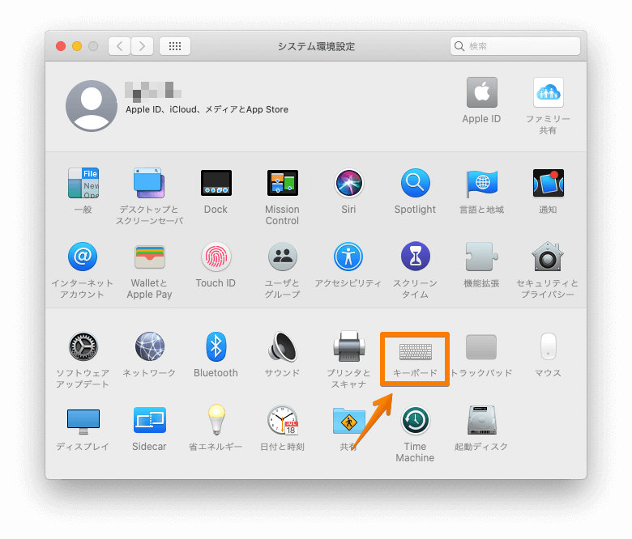
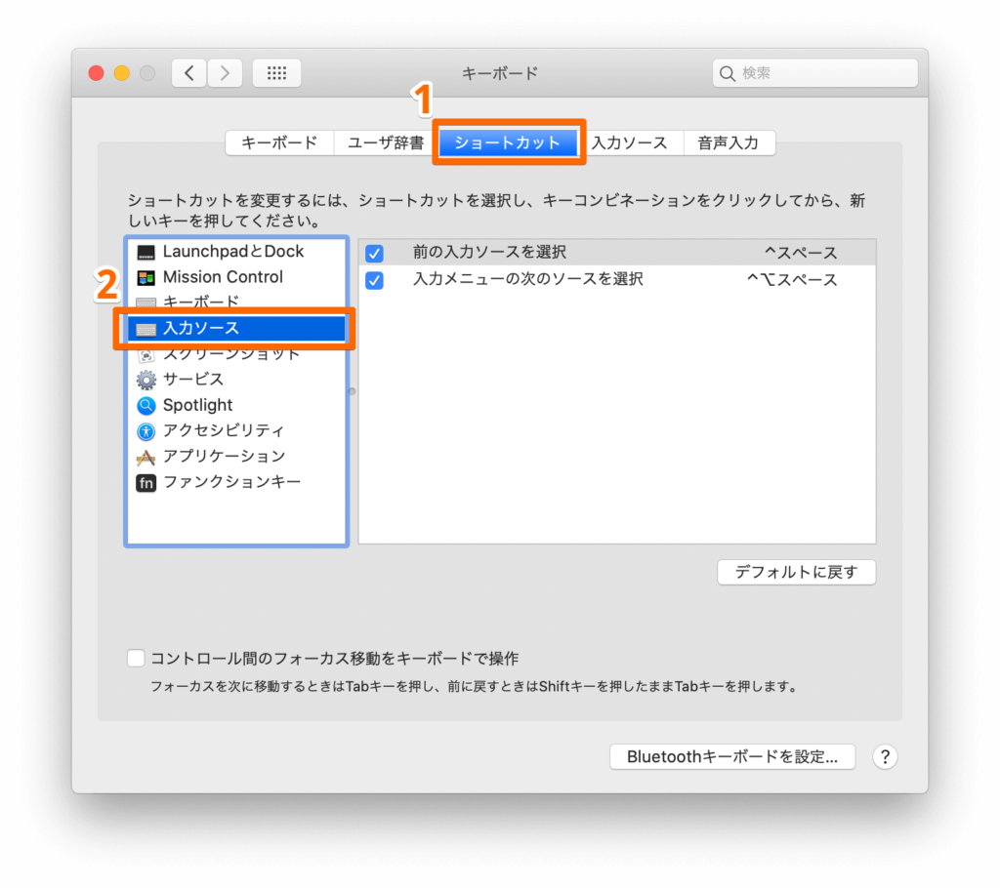
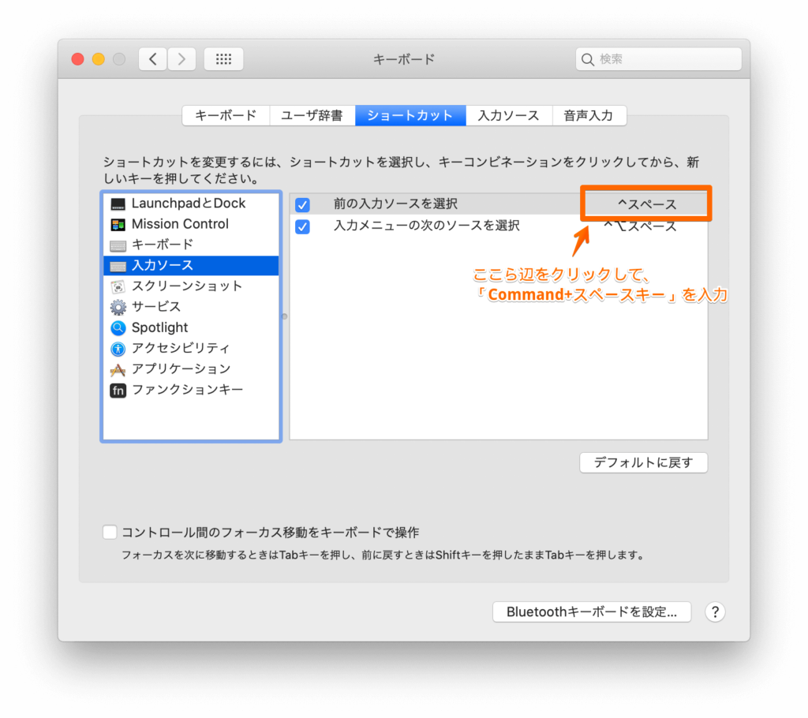
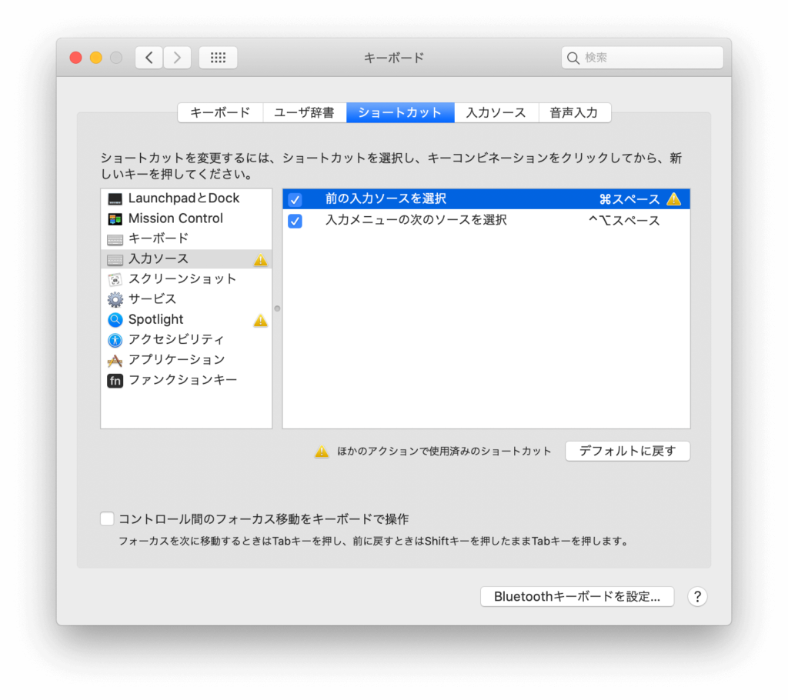
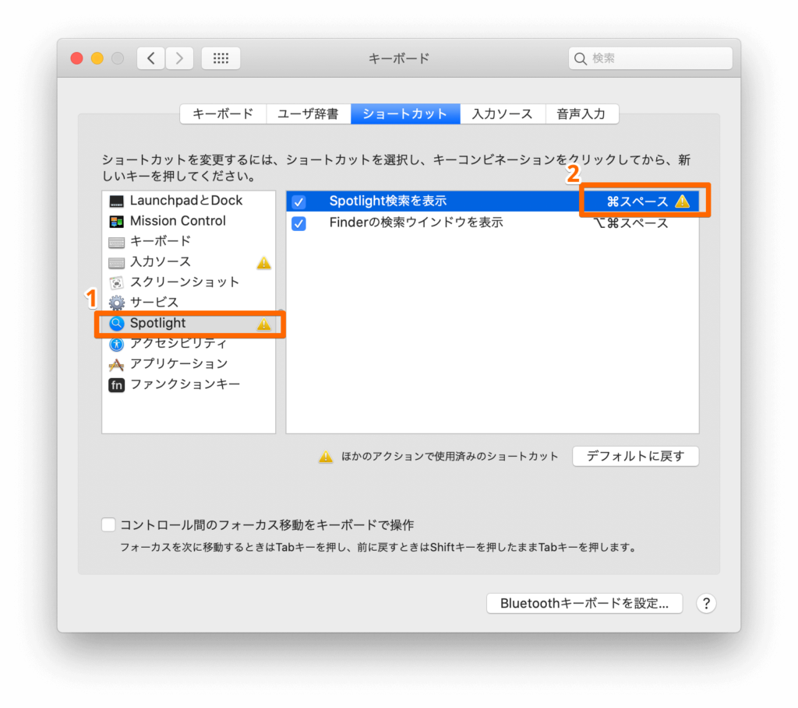
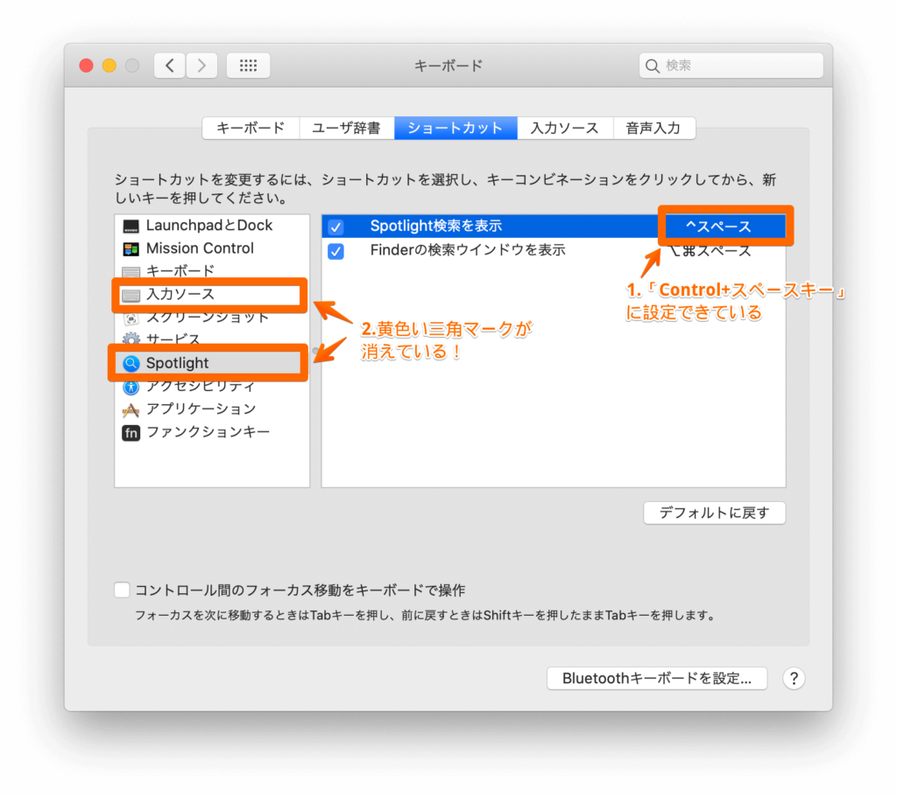
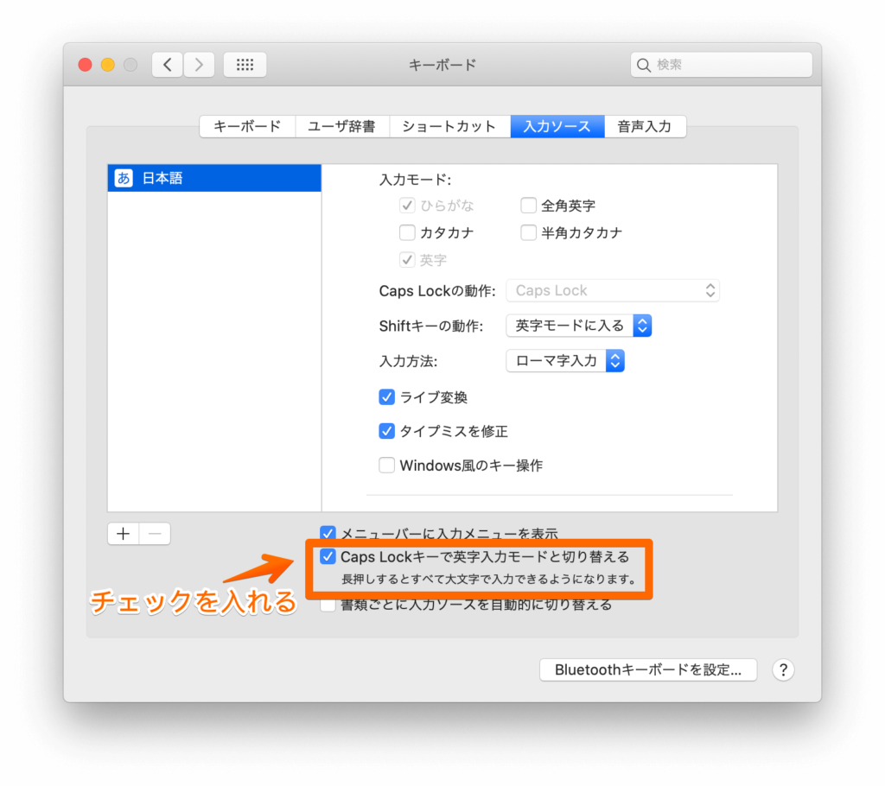

**USキーボードのMacBookを買ったけど、日本語入力への変換がめんどくさい！**

**「英字⇄かな」切替をもっと簡単にする方法はないかな？**

- 本記事の内容
  - USキーボードのMacBookで「英字⇄かな」切替を簡単に行う方法

**今回は、USキーボードのMacBookで「英字⇄かな」切替を簡単に行う方法を紹介します。**

MacBookは見た目がカッコいいUSキーボードを選びました。

徐々にUSキーボードに慣れてきた中で、唯一解決しない問題が「英字⇄かな」切替がめんどくさいことです。

何故なら、USキーボードには「全角/半角」切替ボタンがありません。

さらにMacBookのデフォルトでは「英字⇄かな」切替のショートカットキーが「Control + スペースキー」 に割り当てられています。

そしてこの「Control + スペースキー」がめちゃくちゃ打ちづらい！

**そこで今回は、そんな問題を解決するオススメの方法を2つ紹介します。**

## 方法1.「Command + スペースキー」で切り替える

こちらの方法は、やることはシンプルで、**デフォルトのショートカットキーである「Control + スペースキー」を「Command + スペースキー」に変えるだけです。**

「Command」と「スペースキー」が隣り合っているので、とても簡単に「英字⇄かな」切替ができます。

### 手順1.「システム環境設定」から「キーボード」を選択

まず最初にDockの「システム環境設定」を開き、「キーボード」を選択します。

### 手順2.「ショートカット」タブの「入力ソース」を選択

次に「ショートカット」タブをクリックし、左側のリストから「入力ソース」を選択します。

### 手順3.「前の入力ソースを選択」をクリックしてから新しいキーを設定

次に、「前の入力ソースを選択」をクリックし、「Command + スペースキー」を直接入力します。

#### 黄色い三角マークが出た場合

下の画像のように、「Command + スペースキー」設定後に黄色い三角マークが出た場合はもう少し設定をする必要があります。

この黄色い三角マークは、先ほど設定した「Command + スペースキー」が既に別のアクション(デフォルトでは「Spotlight検索」)のショートカットキーとして割り当てられていることを意味します。

なので既に「Command + スペースキー」が割り当てられていた「Spotlight検索」のショートカットキーを変更することでこの問題は解決します。

手順3と同じように、今度は「Spotlight」→「Spotlight検索を表示」を選択して、「Control + スペースキー」を入力します。

「Control + スペースキー」がちゃんと設定されると以下のように黄色い三角マークは消えます。

以上で設定完了です！

## 方法2.「caps lock」で切り替える

2つ目方法では、「caps lock」ボタンで「英字⇄かな」切り替えを行えるようにします。

### 手順1.「システム環境設定」から「キーボード」を選択

まず最初にDockの「システム環境設定」を開き、「キーボード」を選択します。

### 手順2.「入力ソース」タブを選択し、「Caps Lockキーで英字入力モードと切り替える」をチェック

次に「入力ソース」タブを選択し、「Caps Lockキーで英字入力モードと切り替える」にチェックを入れます。

以上で設定完了です。

**1つのボタンだけで済むので、この方法が最も簡単にUSキーボードで「英字⇄かな」切替をする方法だと思います！**

ただし1つ残念なポイントがあり、この方法2はmacOS Catalina(2019年10月〜)以降のバージョンでしか使用できないことです。

なのでmacOS Catalina以前の人は**方法1.「Command + スペースキー」で切り替える**を使いましょう。

## まとめ

この記事では、USキーボードのMacBookで「英字⇄かな」切替を簡単に行う方法を紹介してきました。

内容をまとめると以下です。

- macOS Catalina以前の方 → **方法1.「Command + スペースキー」で切り替える**
- macOS Catalina以降の方 → **方法2.「caps lock」で切り替える**

快適なUSキーボードライフを！
