## 1. IE記法とは
- ER図の記法の一つ
- IE記法と[IDEFX1記法](https://www.idef.com/idef1x-data-modeling-method/)がメジャー
- 別名「鳥の足記法」(Crow's Foot Notation)
- 明確な規格がない

## 2. IE記法で使われる図形
### 2-1. エンティティ
- エンティティを長方形(角付)で書く
- エンティティ名を長方形の1段目に書く

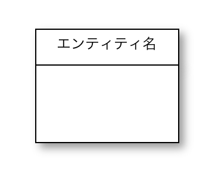

### 2-2. アトリビュート(属性)
- 属性名を長方形の2段目に書く
- 主キーは、属性名の前に``*``を書く

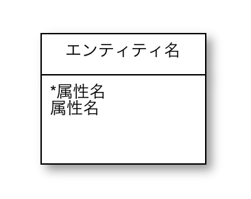

### 2-3. リレーションシップ(関係)
- リレーションシップを実線で書く

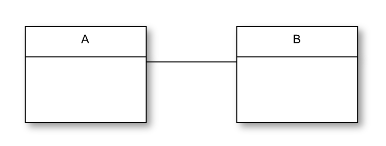

### 2-4. カーディナリティ(多重度)
- カーディナリティとオプショナリティを書く

**カーディナリティ(cardinality)**

- エンティティから近い方に書く
- 関連付くインスタンスの最大数を表す

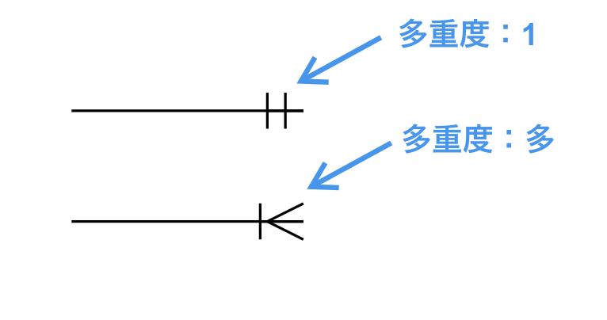

**オプショナリティ(optionality)**

- エンティティから遠い方に書く
- 関連付くインスタンスの最小数を表す
- modalityと言ったりもする
- 1をmandatory(必須)、0をoptional(任意)と呼ぶ

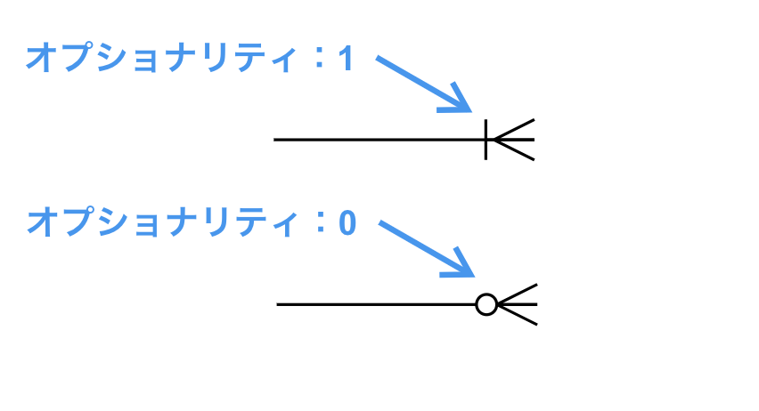

**カーディナリティとオプショナリティ**

|組み合わせ  |オプショナリティ  |カーディナリティ  |Aインスタンス1つに対するBインスタンスの数  |
|---|---|---|---|
|(1)  |1  |1  |1  |
|(2)  |0  |1  |0または1  |
|(3)  |1  |多  |1以上  |
|(4)  |0  |多  |0以上  |

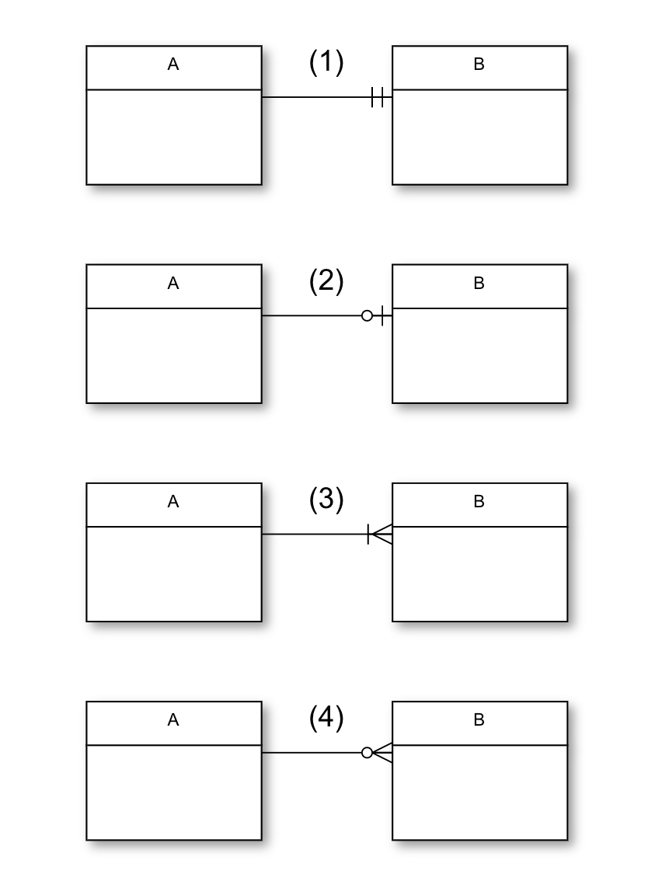

## 3. IE記法で書いたER図
### 3-1. 1対1
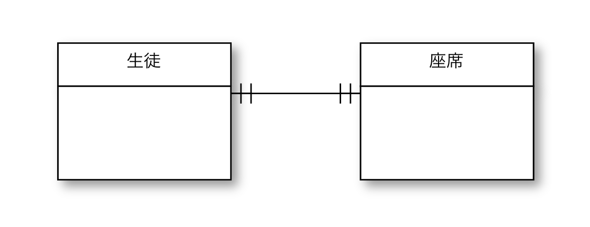

### 3-2. 1対多
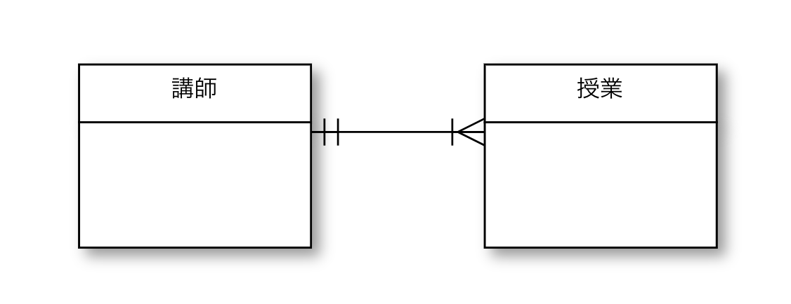

### 3-3. 多対多
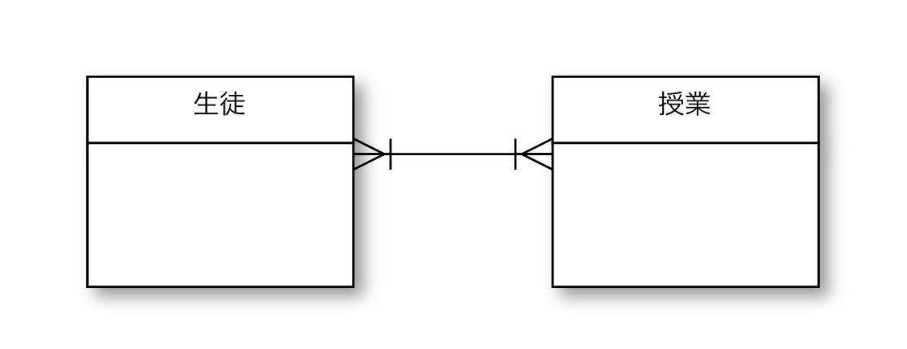

## 4. 自分ならER図をこう書く【パッと見IE記法】
- エンティティは全て長方形(角付)で書く(IE記法)
- エンティティ名を長方形の上(外側)に書く(IDEF1X記法)
- 主キーを長方形の1段目に、その他の属性を長方形の2段目に書く(IDEF1X記法)
- 外部キーは属性名の後ろに``(FK)``を書く(IDEF1X記法)
- リレーションシップと多重度はIE記法で書く(IE記法)

**パッと見IE記法**
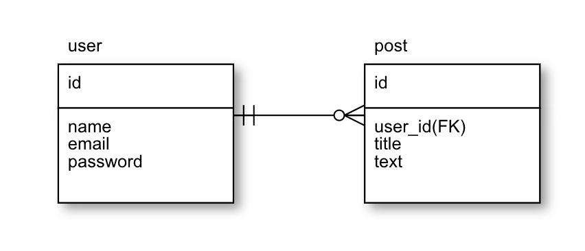

→多重度の表記がIE記法のため、パッと見はIE記法。

## 5. まとめ
多重度にオプショナリティという概念を含めることで、以下のような曖昧な表現がなくなる。

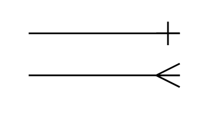

___

- [30分でわかるER図の書き方 (4)](https://simply-k.hatenadiary.org/entry/20100706/1278417587)
- [オプショナリティ - リレーションシップでの多重度の詳細](https://gist.github.com/momotar/b638887741fafacfb251)
- [Crow’s Foot Notation](https://vertabelo.com/blog/crow-s-foot-notation/)
- [IDEF1X Notation](https://vertabelo.com/blog/idef1x-notation/)
- [IDEF1X Method Report](https://www.idef.com/downloads/)

