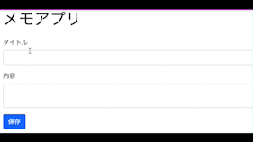

この記事では、RubyのWebアプリケーションフレームワークであるSinatraを使って、シンプルなメモアプリを作成します。

データの保存先にはDBを使わず、JSONファイルを使用します。

## 1. 実行環境

- macOS：12.5
- Ruby：3.1.0
- Bundler：2.3.12
- sinatra：2.2.2
- webrick：1.7.0
- sinatra-contrib：2.2.2

## 2. メモアプリの要件

以下のメモアプリを作成します。



- 機能
  - メモの作成
  - メモの編集
  - メモの削除
  - メモ一覧の表示
  - 特定のメモの表示

## 3. 作成手順

以下の手順で進めていきます。

1. 設計
1. 実装
1. 改良

### 3-1. 設計

まずはアプリケーションの設計を行います。

#### 3-1-1. URI設計

RESTfulなURI設計として、今回は以下のURIを使用します。

|Method|Path|Description|
|---|---|---|
| GET | /memos | メモ一覧を表示 |
| GET | /memos/new | メモ作成画面を表示 |
| GET | /memos/{memo_id}/edit | メモ編集画面を表示 |
| POST | /memos | メモを作成 |
| GET | /memos/{memo_id} | 特定のメモを表示 |
| PATCH | /memos/{memo_id}	| 特定のメモを編集 |
| DELETE | /memos/{memo_id} | 特定のメモを削除 |

#### 3-1-2. ディレクトリ設計

ディレクトリ構成は以下のようになります。

```zsh
memo-app/
  - public/
    - memos.json # データ保存先
  - views/
    - edit.erb # メモ編集画面
    - index.erb # メモ一覧表示画面
    - layout.erb # 各ビューの共通部分
    - new.erb # メモ作成画面
    - show.erb # 特定のメモ表示画面
  - memo.rb # ルーティング定義
```

### 3-2. 実装

次にメインの機能の実装を行います。

#### 3-2-1. ライブラリの用意

まずは必要なgemのインストールを行います。

以下のコマンドを実行し、作業用ディレクトリにGemfileを作成します。

```
$ mkdir memo-app
$ cd memo-app
$ bundle init
```

Gemfileを以下のように編集します。

```ruby
# frozen_string_literal: true

source "https://rubygems.org"

# gem "rails"
gem "sinatra"
gem "webrick"
gem "sinatra-contrib"
```

以下のコマンドを実行してgemをインストールします。

```
$ bundle install
```

#### 3-2-2. メモ一覧の表示

次にメモ一覧の表示を行います。

まずはメモのデータとして以下の`public/memos.json`を作成します。

```json
{
  "1": {
    "title": "メモ1",
    "content": "メモ1の内容"
  },
  "2": {
    "title": "メモ2",
    "content": "メモ2の内容"
  }
}
```
- Rubyのハッシュに変換→`{"1"=>{"title"=>"メモ1", "content"=>"メモ1の内容"}, "2"=>{"title"=>"メモ2", "content"=>"メモ2の内容"}}`

次にルーティングを定義します。

以下の`memo.rb`を作成します。

```ruby
# frozen_string_literal: true

require 'sinatra'
require 'sinatra/reloader'
require 'json'

FILE_PATH = 'public/memos.json'

def get_memos(file_path)
  File.open(file_path) { |f| JSON.parse(f.read) }
end

get '/' do
  redirect '/memos'
end

get '/memos' do
  @memos = get_memos(FILE_PATH)
  erb :index
end
```
- [RubyでJSONファイルを扱う方法 | あまブログ](https://ama-blog.com/47/)

次にメモ一覧を表示するビューを作成します。

以下の`views/layout.erb`を作成します。

```html
<!DOCTYPE html>
<html lang="ja">
<head>
  <meta charset="UTF-8">
  <meta http-equiv="X-UA-Compatible" content="IE=edge">
  <meta name="viewport" content="width=device-width, initial-scale=1.0">
  <!-- Bootstrap CSS -->
  <link href="https://cdn.jsdelivr.net/npm/bootstrap@5.0.2/dist/css/bootstrap.min.css" rel="stylesheet" integrity="sha384-EVSTQN3/azprG1Anm3QDgpJLIm9Nao0Yz1ztcQTwFspd3yD65VohhpuuCOmLASjC" crossorigin="anonymous">
  <title>メモアプリ</title>
</head>
<body>
  <div class="container">
    <h1 class="mb-4">メモアプリ</h1>
    <%= yield %>
  </div>

  <!-- Option 1: Bootstrap Bundle with Popper -->
  <script src="https://cdn.jsdelivr.net/npm/bootstrap@5.0.2/dist/js/bootstrap.bundle.min.js" integrity="sha384-MrcW6ZMFYlzcLA8Nl+NtUVF0sA7MsXsP1UyJoMp4YLEuNSfAP+JcXn/tWtIaxVXM" crossorigin="anonymous"></script>
</body>
</html>
```

- `<%= yield %>`の部分にそれぞれのビューの内容が埋め込まれます。
- CSSに[Bootstrap](https://getbootstrap.jp/)を使用しています。

次にメモ一覧を表示する`views/index.erb`を作成します。

```html
<ul>
  <% @memos.each do |id, post| %>
    <li>
      <%= post["title"] %>
    </li>
  <% end %>
</ul>
```

#### 3-2-3. 特定のメモの表示

次に特定のメモを1件表示させます。

`memo.rb`に以下のルーティングを追加します。

```ruby
# get '/memos' do
# ~

get '/memos/:id' do
  memos = get_memos(FILE_PATH)
  @title = memos[params[:id]]['title']
  @content = memos[params[:id]]['content']
  erb :show
end
```
- [Routes - Sinatra README.md](https://github.com/sinatra/sinatra#routes)

`views/show.erb`を作成します。

```html
<div>
  <p><%= @title %></p>
  <p><%= @content %></p>
</div>
<div>
  <a class="btn btn-secondary" href="/memos">メモ一覧に戻る</a>
</div>
```

`views/index.erb`にメモへのリンクを追加します。

```html
<ul>
  <% @memos.each do |id, post| %>
    <li>
      <a href="/memos/<%= id %>"><%= post["title"] %></a>
    </li>
  <% end %>
</ul>
```

#### 3-2-4. メモの作成

次にメモの作成機能を実装します。

`memo.rb`に以下のルーティングを追加します。

```ruby
# get '/memos' do
# ~

get '/memos/new' do
  erb :new
end

# get '/memos/:id' do
# ~
```

- `get '/memos/new'`を`get '/memos/:id'`より上に書くこと。
  - `:id`はあらゆるURLにマッチするパラメータのため、`/memos/:id`は`/memos/1`や`/memos/2`だけでなく`/memos/new`にもマッチする。ルーティングは上から順に合致するURLを探すため、`/memos/:id`が`/memos/new`より上に定義されていると、`/memos/new`のgetリクエストを受け取った時に`get '/memos/:id'`のルーティングにマッチしてしまいエラーとなる

`views/new.erb`を作成します。

```html
<form action="/memos" method="post">
  <div class="mb-3">
    <label for="title" class="form-label">タイトル</label>
    <input type="text" id="title" name="title" class="form-control">
  </div>
  <div class="mb-3">
    <label for="content" class="form-label">内容</label>
    <textarea id="content" name="content" class="form-control"></textarea>
  </div>
  <div>
    <input type="submit" value="保存" class="btn btn-primary">
  </div>
</form>
```

`memo.rb`に以下のルーティングを追加します。

```ruby
# def get_memos(file_path)
# ~

def set_memos(file_path, memos)
  File.open(file_path, 'w') { |f| JSON.dump(memos, f) }
end

# ~

# get '/memos/:id' do
# ~

post '/memos' do
  title = params[:title]
  content = params[:content]

  memos = get_memos(FILE_PATH)
  id = (memos.keys.map(&:to_i).max + 1).to_s
  memos[id] = { 'title' => title, 'content' => content }
  set_memos(FILE_PATH, memos)

  redirect '/memos'
end
```
- `(memos.keys.map(&:to_i).max + 1).to_s`でidの最大値を探してインクリメント
- PRGパターンで実装(Post→Redirect→Get)

`views/index.erb`にメモ作成画面へのリンクを追加します。

```html
<div class="mb-4">
  <a class="btn btn-secondary" href="/memos/new">メモを作成</a>
</div>
<ul>
  <% @memos.each do |id, post| %>
    <li>
      <a href="/memos/<%= id %>"><%= post["title"] %></a>
    </li>
  <% end %>
</ul>
```

#### 3-2-5. メモの編集

次にメモの編集機能を実装します。

`memo.rb`に以下のルーティングを追加します。

```ruby
# post '/memos' do
# ~

get '/memos/:id/edit' do
  memos = get_memos(FILE_PATH)
  @title = memos[params[:id]]['title']
  @content = memos[params[:id]]['content']
  erb :edit
end
```

`views/edit.erb`を作成します。

```html
<form action="/memos/<%= params[:id] %>" method="post">
  <div class="mb-3">
    <label for="title" class="form-label">タイトル</label>
    <input type="text" id="title" name="title" value="<%= @title %>" class="form-control">
  </div>
  <div class="mb-3">
    <label for="content" class="form-label">内容</label>
    <textarea id="content" name="content" class="form-control"><%= @content %></textarea>
  </div>
  <div>
    <input type="hidden" name="_method" value="patch">
    <input type="submit" value="保存" class="btn btn-primary">
  </div>
</form>
```
- フォームの隠しパラメータ(`hidden`)に`_method`パラメータで本来送りたいメソッドを指定(`value="patch"`)

`memo.rb`に以下のルーティングを追加します。

```ruby
# get '/memos/:id/edit' do
# ~

patch '/memos/:id' do
  title = params[:title]
  content = params[:content]

  memos = get_memos(FILE_PATH)
  memos[params[:id]] = { 'title' => title, 'content' => content }
  set_memos(FILE_PATH, memos)

  redirect "/memos/#{params[:id]}"
end
```

`views/show.erb`に編集ボタンを追加します。

```html
<div>
  <p><%= @title %></p>
  <p><%= @content %></p>
</div>
<div class="d-flex mb-4">
  <form action="/memos/<%= params[:id] %>/edit" method="get">
    <input type="submit" value="編集" class="btn btn-primary me-2">
  </form>
</div>
<div>
  <a class="btn btn-secondary" href="/memos">メモ一覧に戻る</a>
</div>
```

#### 3-2-6. メモの削除

最後にメモの削除機能を実装します。

`memo.rb`に以下のルーティングを追加します。

```ruby
# patch '/memos/:id' do
# ~

delete '/memos/:id' do
  memos = get_memos(FILE_PATH)
  memos.delete(params[:id])
  set_memos(FILE_PATH, memos)

  redirect '/memos'
end
```

`views/show.erb`に削除ボタンを追加します。

```html
<div>
  <p><%= @title %></p>
  <p><%= @content %></p>
</div>
<div class="d-flex mb-4">
  <form action="/memos/<%= params[:id] %>/edit" method="get">
    <input type="submit" value="編集" class="btn btn-primary me-2">
  </form>
  <form action="/memos/<%= params[:id] %>" method="post">
    <input type="hidden" name="_method" value="delete">
    <input type="submit" value="削除" class="btn btn-primary">
  </form>
</div>
<div>
  <a class="btn btn-secondary" href="/memos">メモ一覧に戻る</a>
</div>
```

### 3-3. 改良

最後にセキュリティ面などの改良を行います。

#### 3-3-1. XSS対策(セキュリティ)

XSS対策として、メモの書き込み内容を表示する部分にエスケープ処理を追加します。

`memo.rb`に以下を追加します。

```ruby
require 'cgi'
``` 

`views/index.erb`を以下のように編集します。

```html
<div class="mb-4">
  <a class="btn btn-secondary" href="/memos/new">メモを作成</a>
</div>
<ul>
  <% @memos.each do |id, post| %>
    <li>
      <a href="/memos/<%= id %>"><%= CGI.escapeHTML(post["title"]) %></a>
    </li>
  <% end %>
</ul>
```
- [CGI.escapeHTML](https://docs.ruby-lang.org/ja/latest/method/CGI/s/escapeHTML.html)

`views/show.erb`を以下のように編集します。

```html
<div>
  <p><%= CGI.escapeHTML(@title) %></p>
  <p><%= CGI.escapeHTML(@content) %></p>
</div>
<div class="d-flex mb-4">
  <form action="/memos/<%= params[:id] %>/edit" method="get">
    <input type="submit" value="編集" class="btn btn-primary me-2">
  </form>
  <form action="/memos/<%= params[:id] %>" method="post">
    <input type="hidden" name="_method" value="delete">
    <input type="submit" value="削除" class="btn btn-primary">
  </form>
</div>
<div>
  <a class="btn btn-secondary" href="/memos">メモ一覧に戻る</a>
</div>
```

#### 3-3-2. 改行を反映

メモの書き込み内容の改行を反映するように修正します。

`views/show.erb`を以下のように編集します。

```html
<div>
  <p><%= CGI.escapeHTML(@title) %></p>
  <p><%= CGI.escapeHTML(@content).gsub(/\n/, '<br/>') %></p>
</div>
<div class="d-flex mb-4">
  <form action="/memos/<%= params[:id] %>/edit" method="get">
    <input type="submit" value="編集" class="btn btn-primary me-2">
  </form>
  <form action="/memos/<%= params[:id] %>" method="post">
    <input type="hidden" name="_method" value="delete">
    <input type="submit" value="削除" class="btn btn-primary">
  </form>
</div>
<div>
  <a class="btn btn-secondary" href="/memos">メモ一覧に戻る</a>
</div>
```

以上で終了です。

以下の記事では、今回作成したメモアプリのデータ保存先をPostgreSQLに変更する手順を紹介しています。

[【Ruby】Sinatraでメモアプリを作る(DB編) - あまブログ](https://ama-blog.com/55/)

---

【参考】

- [README.md - Sinatra](https://github.com/sinatra/sinatra#readme)
- [Sinatra: README (Japanese)](https://web.archive.org/web/20220623135317/https://sinatrarb.com/intro-ja.html)
- [Sinatra::Reloader (part of Sinatra::Contrib)](https://sinatrarb.com/contrib/reloader)


