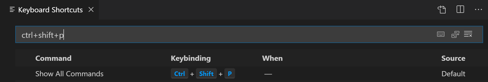

この記事ではMacユーザー向けに、Visual Studio Codeのキーボードショートカットの中から特に使用頻度の高いものを紹介していきます。

## 1. 一般

| 操作 | ショートカット |
|-----------|------------|
| コマンドパレットを開く | `shift + ⌘ + P` |
| クイックオープン | `⌘ + P ` |
| 新規ウィンドウを開く | `shift + ⌘ + N ` |
| ウィンドウを閉じる | `⌘ + W ` |
| ユーザー設定を開く | `⌘ + , ` |
| キーボードショートカットを開く | `⌘ + K`→`⌘ + S` |

## 2. 基本的な編集

| 操作 | ショートカット |
|-----------|------------|
| 行を下に移動／上に移動 | `option + ↓` / `option + ↑`|
| 行の下にコピー/上にコピー | `shift + option + ↓` / `shift + option + ↑`|
| 行の削除 | `shift + ⌘ + K`|
| 行を下に挿入／上に挿入 | `⌘ + Enter` / `shift + ⌘ + Enter`|
| 一致する括弧にジャンプ | `shift + ⌘ + \ `|
| 行のインデント/アウトデント | `⌘ + ]` / `⌘ + [ ` |
| コードを折りたたむ/展開する | `option + ⌘ + [` / `option + ⌘ + ] ` |
| 行コメントの切り替え | `⌘ + /` |
| 補完機能をトリガー | `control + space` `⌘ + I` |

## 3. マルチカーソルと選択

| 操作 | ショートカット |
|-----------|------------|
| カーソルの挿入 | `option + クリック `|
| カーソルを下へ挿入/上へ挿入 | `option + ⌘ + ↓` / `option + ⌘ + ↑`|
| 現在の行を選択 | `⌘ + L `|
| 選択中の文字列と一致する文字列を全て選択 | `shift + ⌘ + L `|
| 矩形選択 | `shift + option + マウスドラッグ` `shift + option + ⌘ + ↑ / ↓ / ← / →` |

## 4. 検索と置換

| 操作 | ショートカット |
|-----------|------------|
| 検索 | `⌘ + F `|
| 置換 | `option + ⌘ + F`|
| 検索結果の次に移動/前に移動 | `⌘ + G` / `shift + ⌘ + G` `Enter` / `shift + Enter`|
| マッチした文字列を全て選択 | `option + Enter`|

## 5. ナビゲーション

| 操作 | ショートカット |
|-----------|------------|
| 指定行へ移動 | `control + G`|
| 問題パネルを開く | `shift + ⌘ + M `|
| パネルの表示/非表示切り替え | `⌘ + J` |

## 6. エディタの管理

| 操作 | ショートカット |
|-----------|------------|
| エディタを閉じる | `⌘ + W `|
| フォルダを閉じる | `⌘ + K` → `F`|
| エディタを垂直分割 | `⌘ + \ `|

## 7. ファイル管理

| 操作 | ショートカット |
|-----------|------------|
| 新規ファイル | `⌘ + N `|
| ファイルを開く | `⌘ + O `|
| 保存 | `⌘ + S `|
| 閉じたエディタを開く | `shift + ⌘ + T`|
| アクティブなファイルを新しいウィンドウに表示する | `⌘ + K` → `O`|
| 最近開いた項目 | `control + R` |

## 8. 表示

| 操作 | ショートカット |
|-----------|------------|
| エディタレイアウトの切り替え（水平／垂直） | `option + ⌘ + 0`|
| サイドバーの表示/非表示の切り替え | `⌘ + B `|
| 出力パネルの表示 | `shift + ⌘ + U`|
| Markdownプレビューをサイドに表示	 | `⌘ + K` → `V`|
| Markdownプレビューを新規ファイルとして表示	 | `shift + ⌘ + V` |
| ターミナルを表示する | `` control + ` `` |
| 新しいターミナルを作成する | `` control + shift + ` `` |

## 9. その他

### 9-1. ユーザが作成したショートカットキーのみを表示する方法

キーボードショートカットエディターの検索欄に`@source:user`を入力する

- キーボードショートカットエディターの開き方
  - `⌘K→⌘S`(またはメニューバーのCode > 基本設定 > キーボードショートカット)
- [Viewing modified keybindings](https://code.visualstudio.com/docs/getstarted/keybindings#_viewing-modified-keybindings)

### 9-2. どのコマンドが特定のキーに割り当てられているか調べる方法

キーボードショートカットエディターの検索欄にキーバインドを入力する

- 主なキー
  - `ctrl`, `shift`, `alt`, `cmd`
  - `left`, `right`, `up`, `down`, `pageup`, `pagedown`, `end`, `home`
  - `tab`, `enter`, `escape`, `space`, `backspace`, `delete`
  - `pausebreak`, `capslock`, `insert`
  - `numpad0-numpad9`, `numpad_multiply`, `numpad_add`, `numpad_separator`
  - `numpad_subtract`, `numpad_decimal`, `numpad_divide`
- [How can I find out what command is bound to a specific key?](https://code.visualstudio.com/docs/getstarted/keybindings#_how-can-i-find-out-what-command-is-bound-to-a-specific-key)

---

【参考】

- [Keyboard shortcuts for Visual Studio Code](https://code.visualstudio.com/docs/configure/keybindings)
- [Visual Studio Code Keyboard shortcuts for macOS](https://code.visualstudio.com/shortcuts/keyboard-shortcuts-macos.pdf)
- [Visual Studio Code tips and tricks](https://code.visualstudio.com/docs/getstarted/tips-and-tricks)
- [45 VS Code Shortcuts for Boosting Your Productivity — SitePoint](https://www.sitepoint.com/visual-studio-code-keyboard-shortcuts/)
