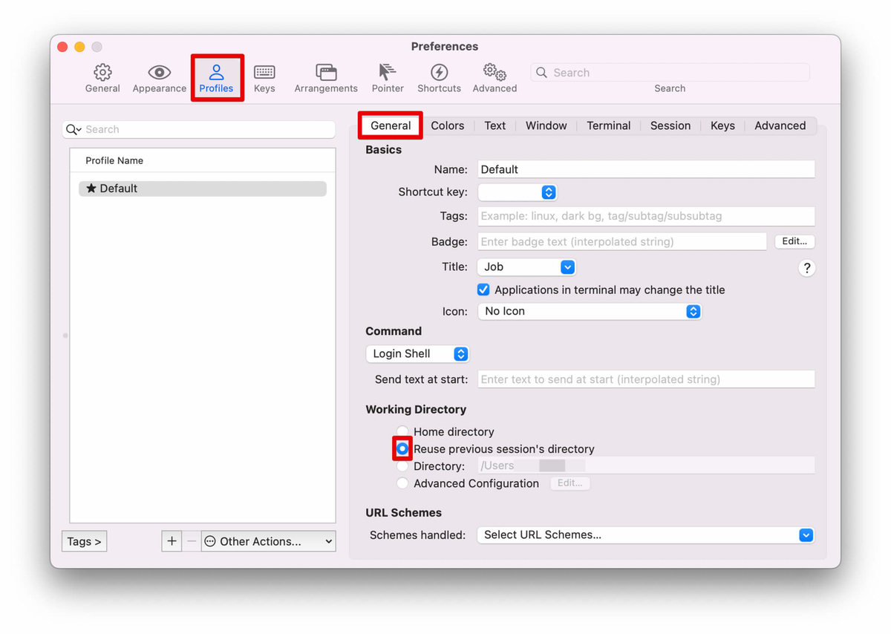

iTerm2のデフォルトでは、ホームディレクトリで新規タブが開かれます。

これを、元のタブと同じディレクトリで新規タブを開くように設定します。

## 1. 実行環境
- iTerm2：3.4.16

## 2. 設定方法

- Preference > Profile > Working Directory > Reuse previous session's directory

以上で設定は終了です。

### 2-1. 追加設定

- Advanced Configuration > Edit...
  - 新規タブのほかに、新規ウィンドウとパネル分割時のディレクトリ設定が可能
