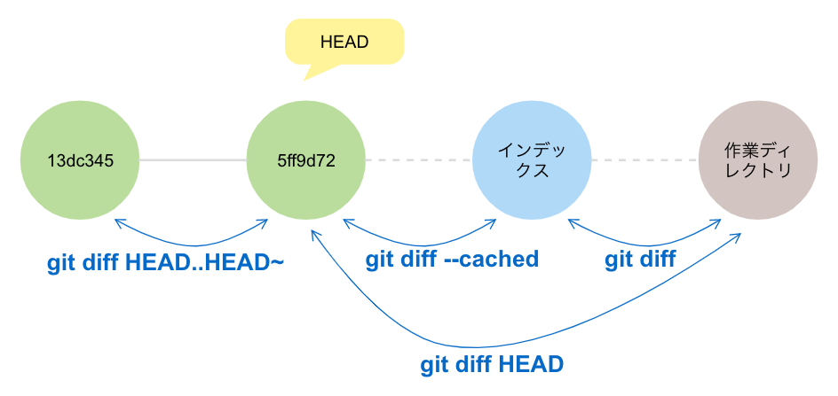

```zsh
# インデックスと作業ディレクトリの比較
$ git diff
```

```zsh
# 最新のコミットとインデックスの比較
$ git diff --cached
$ git diff --staged # 同義
$ git diff --cached HEAD # 同義
```

```zsh
# 最新のコミットと作業ディレクトリの比較
$ git diff HEAD
```

```zsh
# コミット同士の比較
$ git diff HEAD HEAD~
$ git diff HEAD..HEAD~ # 同義
```

```zsh
# ブランチ同士の比較
$ git diff topic..main
```

```zsh
# 特定のファイルのみ
$ git diff -- ./file
$ git diff HEAD -- ./file
```

```zsh
# git pullする前にリモート追跡ブランチとの差分を確認
$ git diff HEAD..origin/main
# git pushする前にリモート追跡ブランチとの差分を確認
$ git diff origin/main..HEAD
```
- 覚え方：`git diff [変更前]..[変更後]`

---

【参考】

- [Git - git-diff Documentation](https://git-scm.com/docs/git-diff)
- [忘れやすい人のための git diff チートシート #Git - Qiita](https://qiita.com/shibukk/items/8c9362a5bd399b9c56be)
- [Git diff | アトラシアン Git チュートリアル](https://www.atlassian.com/ja/git/tutorials/saving-changes/git-diff)
- [git diff - Gitコマンド | WWWクリエイターズ](https://www-creators.com/git-command/git-diff)
- [第9話 git diff で差分を確認！【連載】マンガでわかるGit ～コマンド編～ - itstaffing エンジニアスタイル](https://www.r-staffing.co.jp/engineer/entry/20200228_1)
