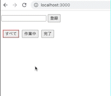

この記事ではVue.jsでToDoリストアプリを作成する方法を紹介します。

HTML, CSS, JSだけを使用し、データはLocalStorageに保存し、Vue3でOptions APIを使用します。

## 1. 実行環境
- macOS：13.0.1
- Node.js：18.12.1
- npm：8.19.2
- Vue：3.2.45

## 2. ToDoアプリの要件
以下のToDoアプリを作成します。

- ToDoが登録できる
- ToDoが一覧表示できる
- ToDoが編集できる
- ToDoが削除できる
- ToDoの処理状態を変更できる
- ToDoの処理状態ごとに表示できる



## 3. 作成手順

### 3-1. ToDoの登録と一覧表示
`index.html`
```html
<!DOCTYPE html>
<html lang="ja">
  <head>
    <meta charset="UTF-8" />
    <meta http-equiv="X-UA-Compatible" content="IE=edge" />
    <meta name="viewport" content="width=device-width, initial-scale=1.0" />
    <title>ToDoアプリ</title>
    <link rel="stylesheet" href="style.css" />
  </head>
  <body>
    <div id="app">
      <form @submit.prevent="addTodo">
        <input v-model="newTodo" />
        <button>登録</button>
      </form>
      <ul>
        <li v-for="todo in todos" :key="todo.id">
          {{ todo.text }}
        </li>
      </ul>
    </div>
    <script type="module" src="app.js"></script>
  </body>
</html>
```
- `@submit.prevent`
  - [HTMLFormElement: submit イベント - Web API | MDN](https://developer.mozilla.org/ja/docs/Web/API/HTMLFormElement/submit_event)
  - [イベント修飾子 | Vue.js](https://ja.vuejs.org/guide/essentials/event-handling.html#event-modifiers)

`app.js`
```javascript
import { createApp } from "https://unpkg.com/vue@3/dist/vue.esm-browser.js";

let id = 0;

createApp({
  data() {
    return {
      newTodo: "",
      todos: [],
    };
  },
  methods: {
    addTodo() {
      this.todos.push({ id: id++, text: this.newTodo });
      this.newTodo = "";
    },
  },
}).mount("#app");
```

### 3-2. ToDoの削除
`index.html`
```html
  <div id="app">
    省略
    <ul>
      <li v-for="todo in todos" :key="todo.id">
        {{ todo.text }}
+      <button @click="removeTodo(todo)">削除</button>
      </li>
    </ul>
  </div>
```

`app.js`
```javascript
  methods: {
    // 省略
+    removeTodo(todo) {
+      this.todos = this.todos.filter((t) => t !== todo);
+    },
  },
```
- `this.todos.filter((t) => t !== todo);`
  - [Array.prototype.filter() - JavaScript | MDN](https://developer.mozilla.org/ja/docs/Web/JavaScript/Reference/Global_Objects/Array/filter)


### 3-3. ToDoの編集
`index.html`
```html
 <ul>
   <li v-for="todo in todos" :key="todo.id">
+    <input
+      v-if="todo === editingTodo"
+      v-model="todo.text"
+      @blur="doneEdit(todo)"
+      @keyup.enter="doneEdit(todo)"
+    />
+    <label v-else>{{ todo.text }}</label>
+    <button @click="doneEdit(todo)" v-if="todo === editingTodo">
+      確定
+    </button>
+    <button @click="editTodo(todo)" v-else>編集</button>
     <button @click="removeTodo(todo)">削除</button>
   </li>
 </ul>
```
- 編集ボタンをクリックすると`editTodo(todo)`して`todo === editingTodo`になり、編集ボタンが確定ボタンに変わり、`label`が`input`に変わりテキストの編集ができる
- `@blur`
  - [Element: blur イベント - Web API | MDN](https://developer.mozilla.org/ja/docs/Web/API/Element/blur_event)
- `@keyup.enter`
  - [Element: keyup イベント - Web API | MDN](https://developer.mozilla.org/ja/docs/Web/API/Element/keyup_event)
  - [キー修飾子 | Vue.js](https://ja.vuejs.org/guide/essentials/event-handling.html#key-modifiers)

`app.js`
```javascript
  data() {
    return {
      // 省略
+     editingTodo: null,
    };
  },
  methods: {
    // 省略
+   editTodo(todo) {
+     this.editingTodo = todo;
+   },
+   doneEdit(todo) {
+     this.editingTodo = null;
+     todo.text = todo.text.trim();
+     if (!todo.text) {
+       this.removeTodo(todo);
+     }
+   },
  },
```
- `todo.text.trim()`
  - [String.prototype.trim() - JavaScript | MDN](https://developer.mozilla.org/ja/docs/Web/JavaScript/Reference/Global_Objects/String/trim)
- `if (!todo.text) { this.removeTodo(todo); }`
  - 全ての文字を削除した状態で編集を確定させた場合、todoを削除する

### 3-4. データをLocalStorageに保存
`app.js`
```javascript
// 省略
+ const STORAGE_KEY = "vue-todoapp";

  createApp({
    data() {
      return {
        newTodo: "",
+       todos: JSON.parse(localStorage.getItem(STORAGE_KEY) || "[]"),
        editingTodo: null,
      };
    },
    methods: {
      addTodo() {
        this.todos.push({ id: id++, text: this.newTodo, done: false });
+       localStorage.setItem(STORAGE_KEY, JSON.stringify(this.todos));
        this.newTodo = "";
      },
      removeTodo(todo) {
        this.todos = this.todos.filter((t) => t !== todo);
+       localStorage.setItem(STORAGE_KEY, JSON.stringify(this.todos));
      },
      editTodo(todo) {
        this.editingTodo = todo;
      },
      doneEdit(todo) {
        this.editingTodo = null;
        todo.text = todo.text.trim();
+       localStorage.setItem(STORAGE_KEY, JSON.stringify(this.todos));
        if (!todo.text) {
          this.removeTodo(todo);
        }
      },
    },
  }).mount("#app");
```
- [Web Storage API の使用 - Web API | MDN](https://developer.mozilla.org/ja/docs/Web/API/Web_Storage_API/Using_the_Web_Storage_API)

### 3-5. ToDoの処理状態の変更
`index.html`
```html
  <li v-for="todo in todos" :key="todo.id">
+  <input type="checkbox" v-model="todo.done" />
    <input
      v-if="todo === editingTodo"
      v-model="todo.text"
      @blur="doneEdit(todo)"
      @keyup.enter="doneEdit(todo)"
    />
+  <label v-else :class="{ done: todo.done }">{{ todo.text }}</label>
    <button @click="doneEdit(todo)" v-if="todo === editingTodo">
      確定
    </button>
    <button @click="editTodo(todo)" v-else>編集</button>
    <button @click="removeTodo(todo)">削除</button>
  </li>
```
- チェックボックスにチェックをつけると`todo.done`の値が`true`に、チェックを外すと`false`になる
- `todo.done`の値によって`done`クラスが動的に切り替わる

`app.js`
```javascript
  addTodo() {
+   this.todos.push({ id: id++, text: this.newTodo, done: false });
    localStorage.setItem(STORAGE_KEY, JSON.stringify(this.todos));
    this.newTodo = "";
  },
```

`style.css`
```css
+ .done {
+   text-decoration: line-through;
+ }
```

### 3-6. ToDoの処理状態ごとの表示
`index.html`
```html
  <ul>
+   <li v-for="todo in filteredTodos" :key="todo.id">
      <!-- 省略 -->
    </li>
  </ul>
+ <ul class="filters">
+   <li>
+     <button
+       @click="changeVisibility('all')"
+       :class="{ selected: visibility === 'all' }"
+     >
+       すべて
+     </button>
+   </li>
+   <li>
+     <button
+       @click="changeVisibility('active')"
+       :class="{ selected: visibility === 'active' }"
+     >
+       作業中
+     </button>
+   </li>
+   <li>
+     <button
+       @click="changeVisibility('done')"
+       :class="{ selected: visibility === 'done' }"
+     >
+       完了
+     </button>
+   </li>
+ </ul>
```
- 各ボタンをクリックすることで`visibility`の値を`all`,`active`,`done`に切り替える
- `visibility`の値によって`selected`クラスが該当のボタンに付与される

`app.js`
```javascript
// 省略
+ const filters = {
+   all: (todos) => todos,
+   active: (todos) => todos.filter((todo) => !todo.done),
+   done: (todos) => todos.filter((todo) => todo.done),
+ };

  createApp({
    data() {
      return {
        // 省略
+       visibility: "all",
      };
    },
+   computed: {
+     filteredTodos() {
+       return filters[this.visibility](this.todos);
+     },
+   },
    methods: {
      // 省略
+     changeVisibility(visibility) {
+       this.visibility = visibility;
+     },
    },
  }).mount("#app");
```
- `return filters[this.visibility](this.todos);`
  - `this.visibility`の値によって(`all`,`active`,`done`)、呼び出すメソッドが切り替わる

`style.css`
```css
/* 省略 */
+ ul {
+   padding: 0;
+ }
+ .filters li {
+     display: inline;
+ }
+ .filters li button.selected {
+     border-color: #CE4646;
+ }
```

---

【参考】

- [Tutorial | Vue.js](https://ja.vuejs.org/tutorial/#step-1)
- [Examples - TodoMVC | Vue.js](https://ja.vuejs.org/examples/#todomvc)
